# Modbus

EdgeX - Delhi Release

PowerScout 3037 Power Submeter

<https://shop.dentinstruments.com/products/powerscout-3037-ps3037>
<https://www.dentinstruments.com/hs-fs/hub/472997/file-2378482732-pdf/Pdf_Files/PS3037_Manual.pdf>

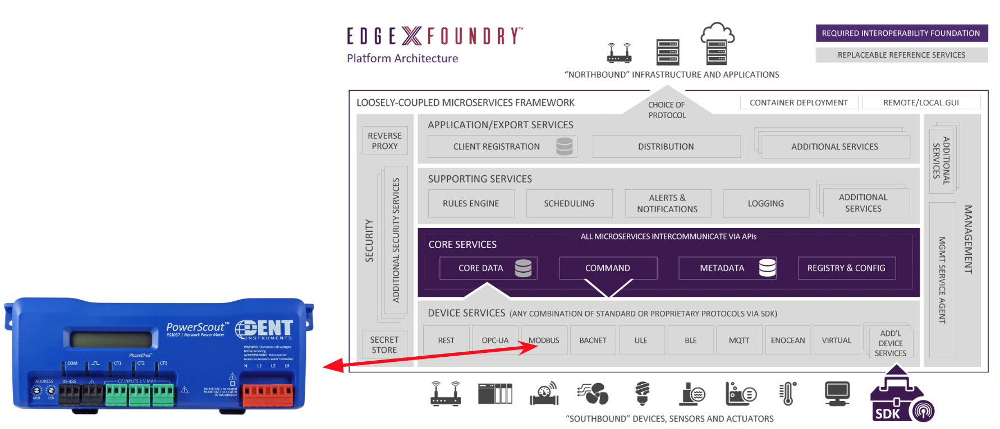

In this example, we simulate the PowerScout meter instead of using a
real device. This provides a straight-forward way to test the
device-modbus features.

## Environment

You can use any operating system that can install docker and
docker-compose. In this example, we use Photon OS to delpoy EdgeX using
docker. The system requirements can be found at
<https://docs.edgexfoundry.org/Ch-GettingStartedUsers.html#what-you-need>.

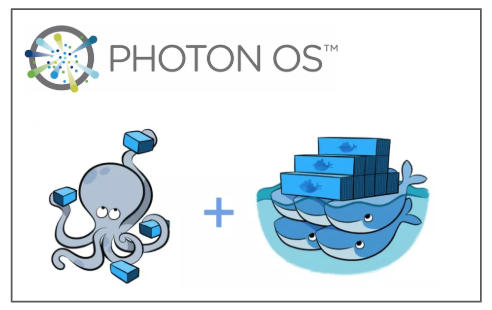

## Modbus Device (Simulator)

<http://modbuspal.sourceforge.net/>

To simulate sensors, such as temperature and humidity, do the following:

1.  Add two mock devices:

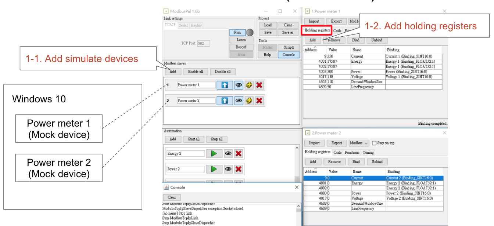

2.  Add registers according to the device manual:

    > 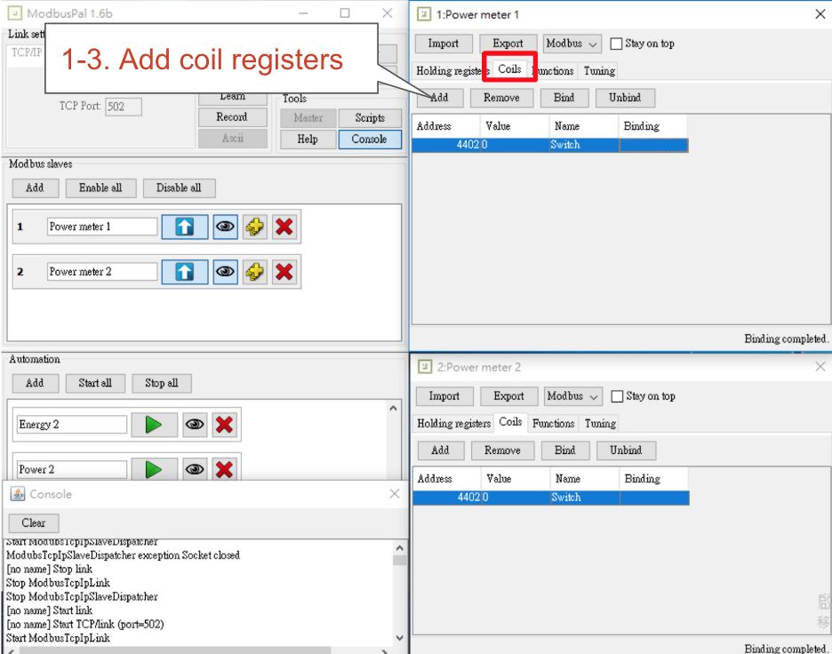

3.  Add the ModbusPal support value auto-generator, which can bind to
    registers:

    > 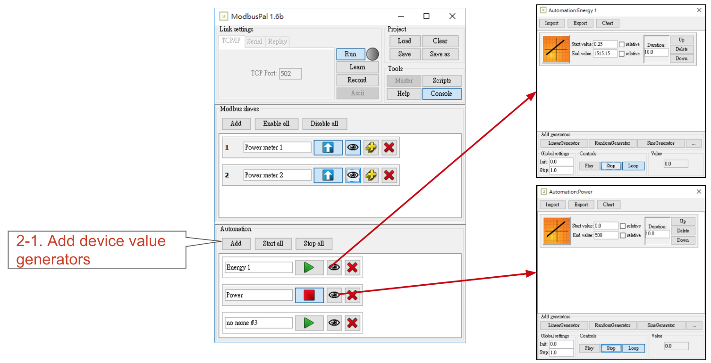
    >
    > 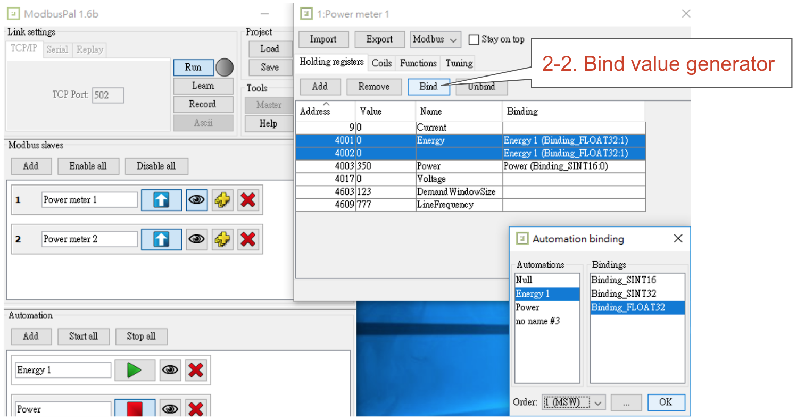

## Set Up Before Starting Services

The following sections describe how to complete the set up before
starting the services. If you prefer to start the services and then add
the device, see [Set Up After Starting
Services](#set-up-after-starting-services)

### Set Up Device Profile

The DeviceProfile defines the device's values and operation method,
which can be Read or Write.

You can download and use the provided `modbus.test.device.profile.yml
<modbus.test.device.profile.yml>`{.interpreted-text role="download"}.

In the Modbus protocol, we must define attributes:

-   `primaryTable`: HOLDING\_REGISTERS, INPUT\_REGISTERS, COILS,
    DISCRETES\_INPUT

-   `startingAddress` specifies the address in Modbus device

    > 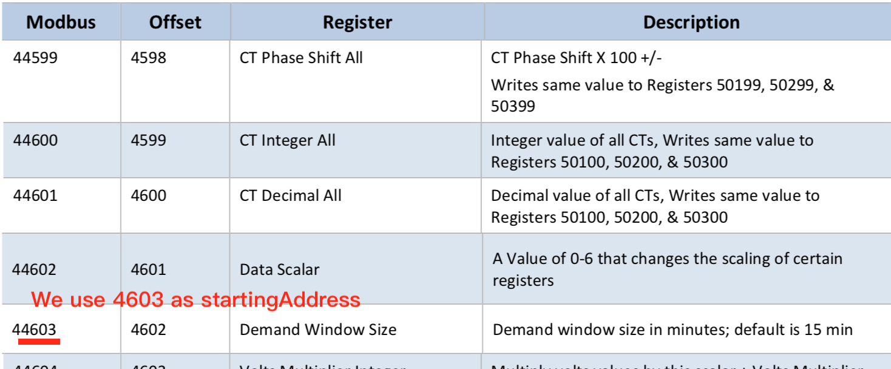

The Property value type decides how many registers will be read. Like
Holding registers, a register has 16 bits. If the device manual
specifies that a value has two registers, define it as FLOAT32 or INT32
or UINT32 in the deviceProfile.

Once we execute a command, device-modbus knows its value type and
register type, startingAddress, and register length. So it can read or
write value using the modbus protocol.

> 

#### \|

> 

#### \|

> 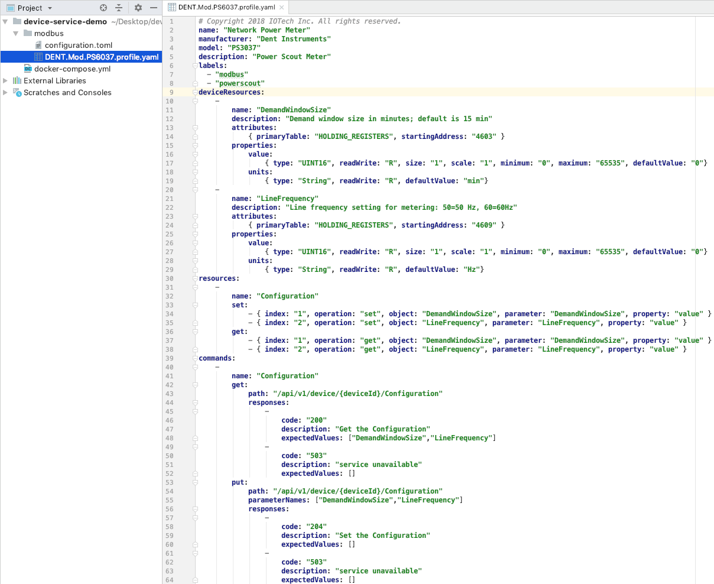

### Set Up Device Service Configuration

Use this configuration file to define devices and schedule jobs. The
device-modbus generates a relative instance on startup.

device-modbus offers two types of protocol, Modbus TCP and Modbus RTU.
An addressable can be defined as shown below:

  
  |protocol        | Name            | Protocol   | Address                  | Port    | Path|
  |--------------- | --------------- | ---------- | ------------------------ | ------- | -------|
  |Modbus TCP      | Gateway address | TCP        | 10.211.55.6              | 502     | 1 1|
  |Modbus RTU      | Gateway address | RTU        | /tmp/slave,19200,8,1,0   | 502     | 2 2|
  

Path defines the Modbus device's unit ID (or slave ID).

In the RTU protocol, address is defined in five comma-separated parts:

-   serial port
-   baud rate
-   data bits
-   stop bits
-   parity (N - None is 0, O - Odd is 1, E - Even is 2, default is E).

<!-- -->

    [Logging]
    EnableRemote = false
    File = "./device-Modbus.log"
    Level = "DEBUG"

    [Device]
      DataTransform = true
      InitCmd = ""
      InitCmdArgs = ""
      MaxCmdOps = 128
      MaxCmdValueLen = 256
      RemoveCmd = ""
      RemoveCmdArgs = ""
      ProfilesDir = "/custom-config"

    # Pre-define Devices
    [[DeviceList]]
      Name = "Modbus TCP test device"
      Profile = "Network Power Meter"
      Description = "This device is a product for monitoring and controlling digital inputs and outputs over a LAN."
      labels = [ "Air conditioner","modbus TCP" ]
      [DeviceList.Addressable]
        name = "Gateway address 1"
        Protocol = "TCP"
        Address = "10.211.55.6"
        Port = 502
        Path = "1"

    [[DeviceList]]
      Name = "Modbus TCP test device 2"
      Profile = "Network Power Meter"
      Description = "This device is a product for monitoring and controlling digital inputs and outputs over a LAN."
      labels = [ "Air conditioner","modbus TCP" ]
      [DeviceList.Addressable]
        name = "Gateway address 1"
        Protocol = "TCP"
        Address = "10.211.55.6"
        Port = 502
        Path = "2"

> \# Pre-define Schedule Configuration
>
> :   \[\[Schedules\]\] Name = "20sec-schedule" Frequency = "PT20S"
>
>     \[\[ScheduleEvents\]\] Name = "Read Switch status" Schedule =
>     "20sec-schedule" \[ScheduleEvents.Addressable\] HTTPMethod =
>     "GET" Path = "/api/v1/device/name/Modbus TCP test device
>     1/Configuration"
>
>     \[\[ScheduleEvents\]\] Name = "Put Configuration" Parameters =
>     "\[{"DemandWindowSize": "110"},{"LineFrequency":
>     "50"}\]" Schedule = "20sec-schedule"
>     \[ScheduleEvents.Addressable\] HTTPMethod = "Put" Path =
>     "/api/v1/device/name/Modbus TCP test device 1/Configuration"
>
You can download and use the provided
`EdgeX_ExampleModbus_configuration.toml
<EdgeX_ExampleModbus_configuration.toml>`{.interpreted-text
role="download"}.

### Add Device Service to docker-compose File

Because we deploy EdgeX using docker-compose, we must add the
device-modbus to the docker-compose file (
<https://github.com/edgexfoundry/developer-scripts/blob/master/releases/fuji/compose-files/docker-compose-fuji.yml>
). If you have prepared configuration files, you can mount them using
volumes and change the entrypoint for device-modbus internal use.

> 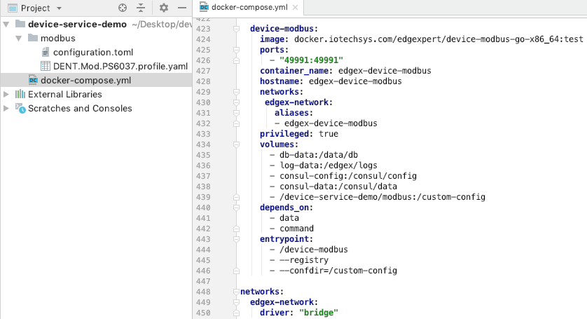

## Start EdgeX Foundry on Docker

Finally, we can deploy EdgeX in the Photon OS.

1.  Prepare configuration files by moving the files to the Photon OS

2.  Deploy EdgeX using the following commands:

        docker-compose pull
        docker-compose up -d

> 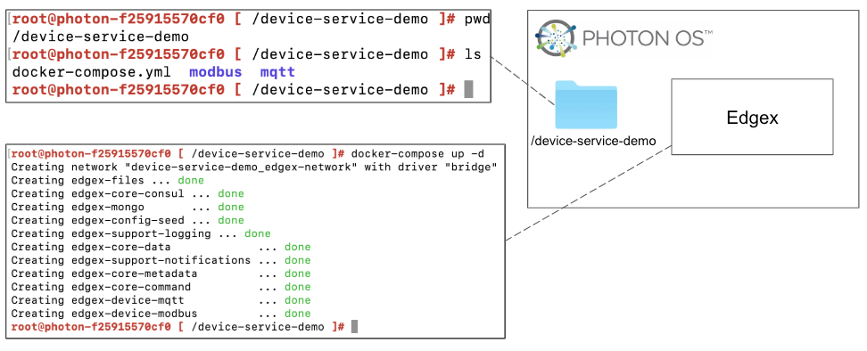

3.  Check the consul dashboard

    > 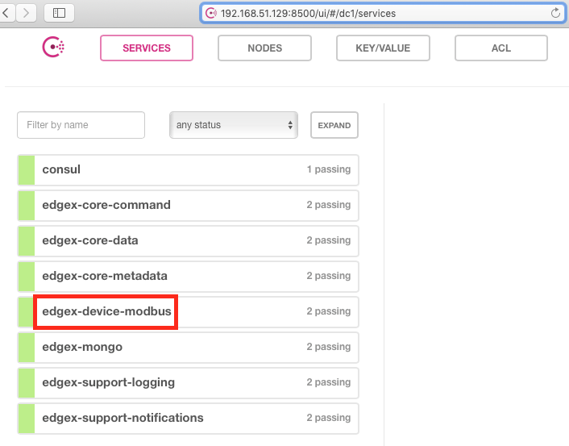

## Set Up After Starting Services

If the services are already running and you want to add a device, you
can use the Core Metadata API as outlined in this section. If you set up
the device profile and Service as described in [Set Up Before Starting
Services](#set-up-before-starting-services), you can skip this section.

To add a device after starting the services, complete the following
steps:

1.  Upload the device profile above to metadata with a POST to
    <http://localhost:48081/api/v1/deviceprofile/uploadfile> and add the
    file as key "file" to the body in form-data format, and the created
    ID will be returned. The following figure is an example if you use
    Postman to send the request

    > 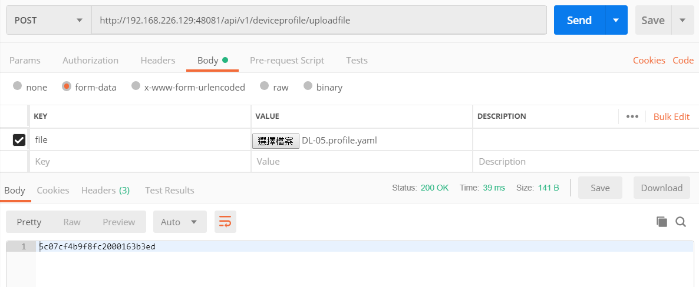

2.  Add the addressable containing reachability information for the
    device with a POST to <http://localhost:48081/api/v1/addressable>:

    > a.  If IP connected, the body will look something like: { "name":
    >     "Motor", "method": "GET", "protocol": "HTTP", "address":
    >     "10.0.1.29", "port": 502 }
    > b.  If serially connected, the body will look something like: {
    >     "name": "Motor", "method": "GET", "protocol": "OTHER",
    >     "address": "/dev/ttyS5,9600,8,1,1", "port": 0 } (address field
    >     contains port, baud rate, number of data bits, stop bits, and
    >     parity bits in CSV form)

3.  Ensure the Modbus device service is running, adjust the service name
    below to match if necessary or if using other device services.

4.  Add the device with a POST to
    <http://localhost:48081/api/v1/device>, the body will look something
    like:

        {
          "description": "MicroMax Variable Speed Motor",
          "name": "Variable Speed motor",
          "adminState": "unlocked",
          "operatingState": "enabled",
          "addressable": {
            "name": "Motor"

          },
          "labels": [

          ],
          "location": null,
          "service": {
            "name": "edgex-device-modbus"

          },
          "profile": {
            "name": "GS1-VariableSpeedMotor"

          }
        }

    The addressable name must match/refer to the addressable added in
    Step 2, the service name must match/refer to the target device
    service, and the profile name must match the device profile name
    from Step 1.

## Execute Commands

Now we're ready to run some commands.

### Find Executable Commands

Use the following query to find executable commands:

    photon-ip:48082/api/v1/device

| 

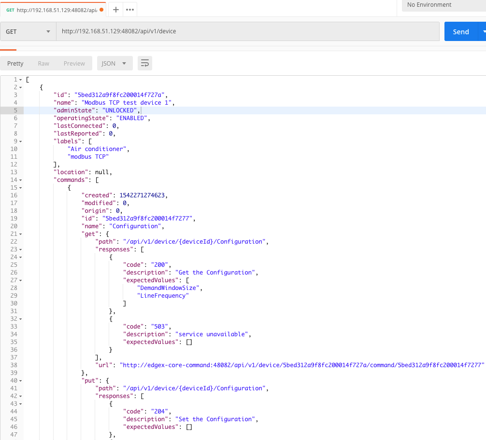

### Execute GET command

Replace *\<host\>* with the server IP when running the
edgex-core-command.

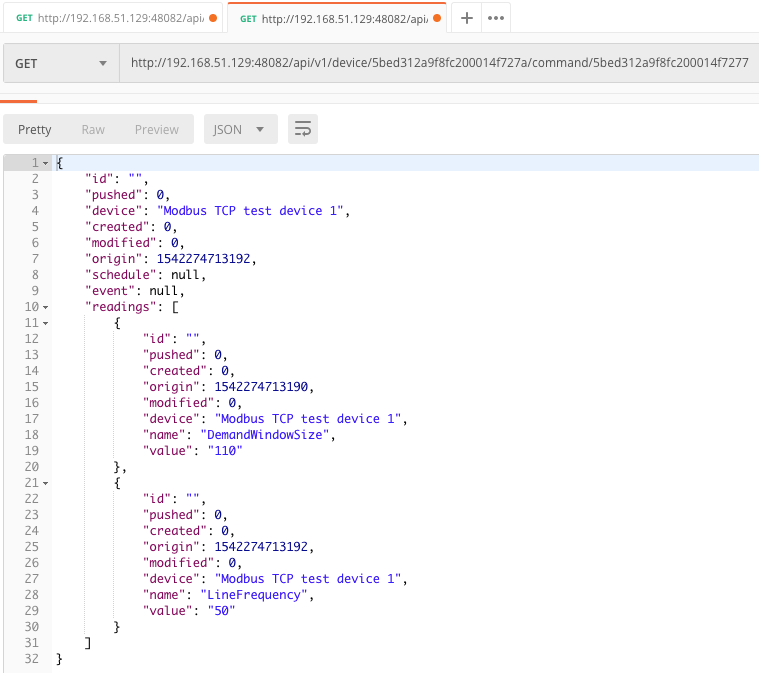

### Execute PUT command

Execute PUT command according to `url` and `parameterNames`.

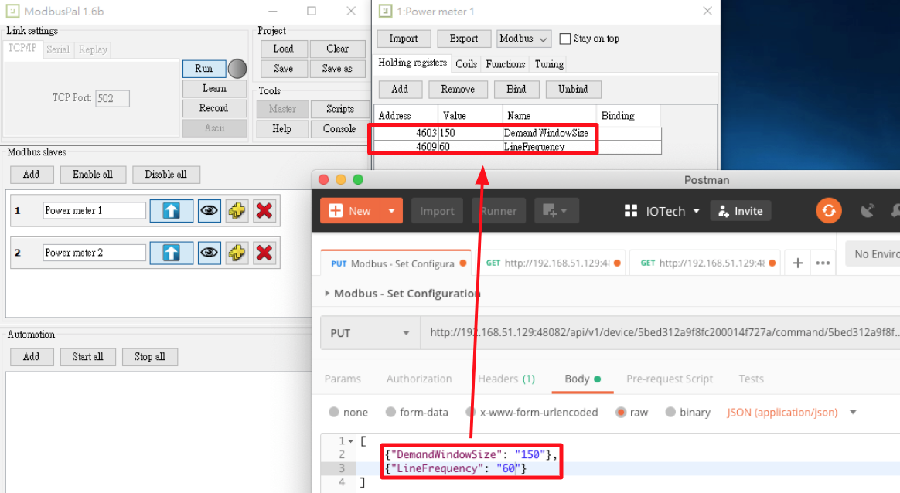

## Schedule Job

After service startup, query core-data's reading API. The results show
that the service auto-executes the command every 20 seconds.

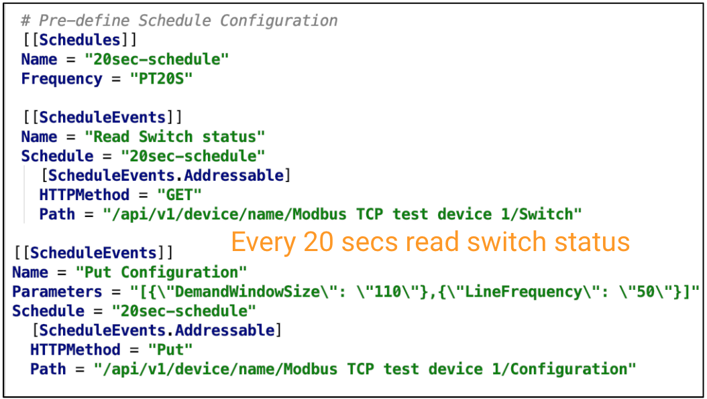

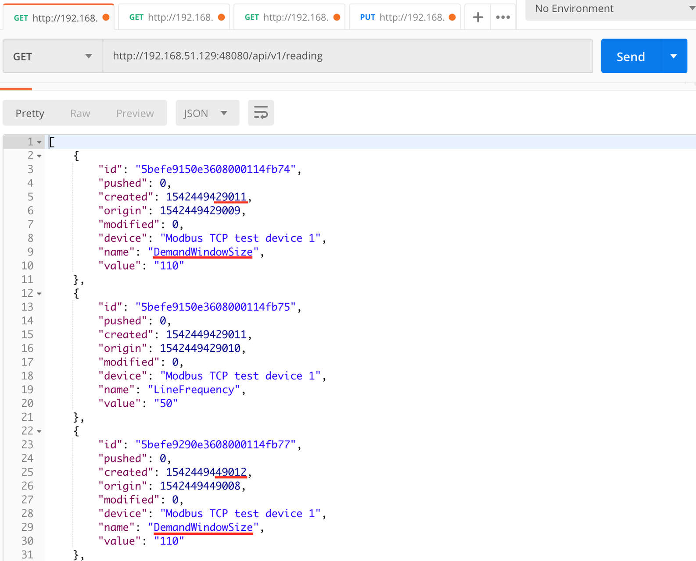
