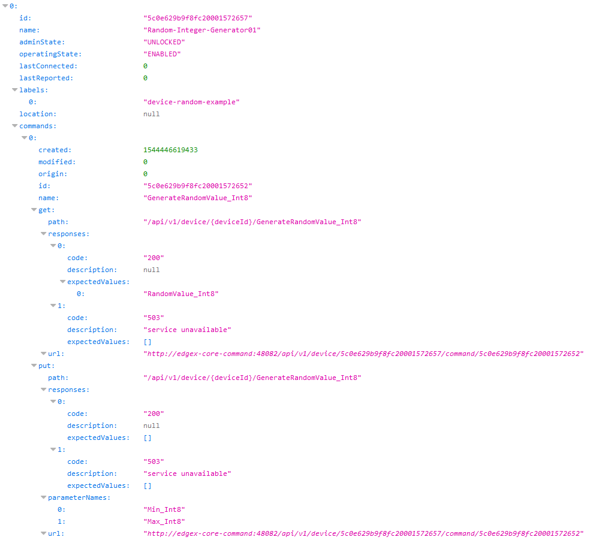
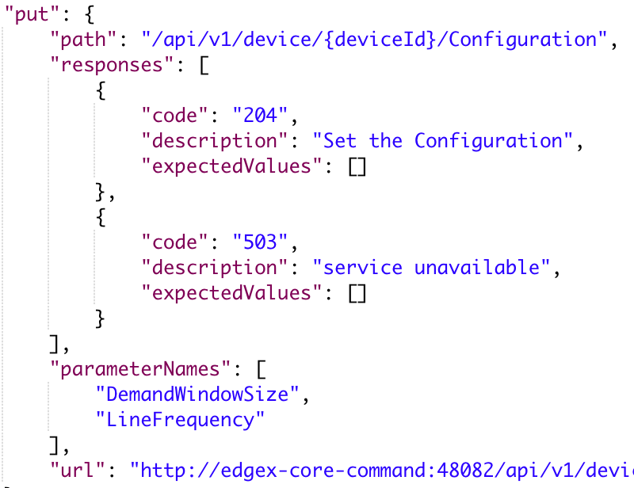
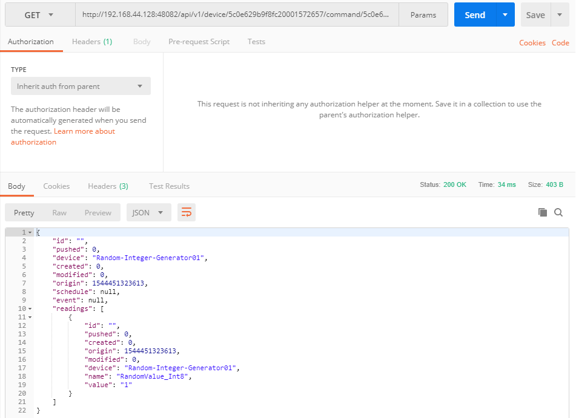

# Random Integer Device Service Example

The Random Integer Device Service is a sample Device Service that can
run directly with other EdgeX services. It has a default, pre-defined
device profile (see the *device.random.yaml* file), device and schedule
events (see the *configuration.toml* file). After the EdgeX Core Service
and Random Integer Device Service start, the following Core Service APIs
can be viewed in the browser:

  
|Core Service |API	URL	|Description|
| --- | --- | --- |
|Core Metadata	|http://[host]:48081/api/v1/deviceservice/device-random	|Device Service created|
|Core Metadata	|http://[host]:48081/api/v1/deviceprofile/Random-Integer-Generator	|Device profile created|
|Core Metadata	|http://[host]:48081/api/v1/device/Random-Integer-Generator01	|Device created|
|Core Metadata	|http://[host]:48081/api/v1/scheduleevent/readValue_int16	|Schedule created|
|Core Metadata	|http://[host]:48081/api/v1/scheduleevent/readValue_int32	|Schedule created|
|Core Data	|http://[host]:48080/api/v1/event |	GenerateRandomValue_Int16 and GenerateRandomValue_Int32 called every 5 seconds to produce events and readings according to the readValue_int16 and readValue_int32 |Schedule Events|
|Core Command	|http://[host]:48082/api/v1/device |	The following commands are available for GET and PUT methods: - GenerateRandomValue_Int8 - GenerateRandomValue_Int16 - GenerateRandomValue_Int32|

## Running Commands

The command execution URLs can be acquired using a Core Command API
inquiry. The command URL is
`http://[host]:48082/api/v1/device/[device id]/command/[command id]`.
For example:

### GET Command

If you replace the host and run the GET command for
GenerateRandomValue\_Int8, you receive an event with a random reading
value between -128 and 127, as illustrated below:

### PUT Command

PUT commands can adjust the minimum and maximum values for future random
reading values, but they must be valid values for the data type. For
example, the minimum value for GenerateRandomValue\_Int16 cannot be less
than -32768.

In the following example, the PUT command limits the future reading
value of GenerateRandomValue\_Int8 to a range of -2 to 2:

!!! Note
    The parameter of the PUT command body is defined in the `parameterNames`
    field of the Command model.

To validate the result, send the following GET command:

