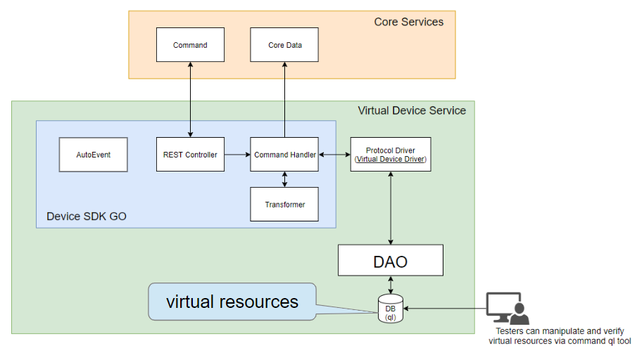

# Using the Virtual Device Service

## Overview

The [Virtual Device Service
GO](https://github.com/edgexfoundry/device-virtual-go) can simulate
different kinds of devices to generate Events and Readings to the Core
Data Micro Service. Furthermore, users can send commands and get
responses through the Command and Control Micro Service. The Virtual
Device Service allows you to execute functional or performance tests
without any real devices. This version of the Virtual Device Service is
implemented based on [Device SDK
GO](https://github.com/edgexfoundry/device-sdk-go), and uses
[ql](https://godoc.org/modernc.org/ql) (an embedded SQL database engine)
to simulate virtual resources.



### Sequence Diagram


## Virtual Resource Table Schema

  
  |Column                                          |Type|
  | --- | --- |
  |DEVICE\_NAME                                    |STRING|
  |COMMAND\_NAME                                   |STRING|
  |DEVICE\_RESOURCE\_NAME                          |STRING|
  |ENABLE\_RANDOMIZATION                           |BOOL|
  |DATA\_TYPE                                      |STRING|
  |VALUE                                           |STRING|
  

## How to Use

The Virtual Device Service depends on the EdgeX Core Services. If
you're going to download the source code and run the Virtual Device
Service in dev mode, make sure that the EdgeX Core Services are up
before starting the Virtual Device Service.

The Virtual Device Service currently contains four pre-defined devices
(see the
[configuration.toml](https://github.com/edgexfoundry/device-virtual-go/blob/master/cmd/res/configuration.toml))
as random value generators:

  
  |Device Name |                        Device Profile|
  | --- | --- |
  |Random-Boolean-Device   |            [device.virtual.bool.yaml](https://github.com/edgexfoundry/device-virtual-go/blob/master/cmd/res/device.virtual.bool.yaml) |
  |Random-Float-Device   |              [device.virtual.float.yaml](https://github.com/edgexfoundry/device-virtual-go/blob/master/cmd/res/device.virtual.float.yaml) |
  |Random-Integer-Device  |             [device.virtual.int.yaml](https://github.com/edgexfoundry/device-virtual-go/blob/master/cmd/res/device.virtual.int.yaml) |
  |Random-UnsignedInteger-Device  |     [device.virtual.uint.yaml](https://github.com/edgexfoundry/device-virtual-go/blob/master/cmd/res/device.virtual.uint.yaml) |
  

**Restricted:** To control the randomization of device resource values,
it has to add additional device resources with the prefix
"EnableRandomization\_" for each device resource. (Need to do the same
for device commands and core commands) Please find the above default
device profiles for example.

Acquire the executable commands information by inquiring the Core
Command API:

-   <http://[host]:48082/api/v1/device/name/Random-Boolean-Device>
-   <http://[host]:48082/api/v1/device/name/Random-Integer-Device>
-   <http://[host]:48082/api/v1/device/name/Random-UnsignedInteger-Device>
-   <http://[host]:48082/api/v1/device/name/Random-Float-Device>

### GET command example

``` bash
curl -X GET localhost:48082/api/v1/device/1bd5d4c3-9d43-42f2-8c4a-f32f5999edf7/command/e5d7c2b8-eab7-4da4-9d41-388da05979a4`
```
``` json
{
  "device": "Random-Integer-Device",
  "origin": 1574325994604494491,
  "readings": [
    {
      "origin": 1574325994572380549,
      "device": "Random-Integer-Device",
      "name": "Int8",
      "value": "42"
    }
  ],
  "EncodedEvent": null
}
```
### PUT command example - Assign a value to a resource

The value must be a valid value for the data type. For example, the
minimum value of Int8 cannot be less than -128 and the maximum value
cannot be greater than 127.
``` bash
curl -X PUT -d '{"Int8": "123"}' \
localhost:48082/api/v1/device/1bd5d4c3-9d43-42f2-8c4a-f32f5999edf7/command/e5d7c2b8-eab7-4da4-9d41-388da05979a4
```
### PUT command example - Enable/Disable the randomization of the resource
``` bash
curl -X PUT -d '{"EnableRandomization_Int8": "false"}' \
localhost:48082/api/v1/device/1bd5d4c3-9d43-42f2-8c4a-f32f5999edf7/command/e5d7c2b8-eab7-4da4-9d41-388da05979a4
```
!!! Note
    -   The value of the resource's EnableRandomization property is
        simultaneously updated to false when sending a put command to assign
        a specified value to the resource

    -   The minimum and maximum values of the resource can be defined in the
        property value field of the Device Resource model, for example:

            deviceResources:
            - name: "Int8"
              description: "Generate random int8 value"
              properties:
                value:
                  { type: "Int8", readWrite: "R", minimum: "-100", maximum: "100", defaultValue: "0" }
                units:
                  { type: "String", readWrite: "R", defaultValue: "random int8 value" }


## Manipulate Virtual Resources Using the command ql Tool

1.  Install [command ql](https://godoc.org/modernc.org/ql/ql)

2.  If the Virtual Device Service runs in a Docker container, it must
    mount the directory (/db) that contains the ql database in the
    container. For example:
``` yaml
device-virtual:
  image: edgexfoundry/docker-device-virtual-go:1.1.0
  ports:
    - "49990:49990"
  container_name: device-virtual
  hostname: device-virtual
  networks:
    - edgex-network
  volumes:
    - db-data:/data/db
    - log-data:/edgex/logs
    - consul-config:/consul/config
    - consul-data:/consul/data
    - /mnt/hgfs/EdgeX/DeviceVirtualDB:/db # Mount ql database directory
  depends_on:
    - data
    - command
```
3.  If the Virtual Device Service runs in dev mode, the ql database
    directory is under the driver directory

Command examples:

-   Query all data:
``` bash
ql -db /path-to-the-ql-db-folder/deviceVirtual.db -fld "select * from VIRTUAL_RESOURCE"
```
-   Update Enable\_Randomization:
``` bash
ql -db /path-to-the-ql-db-folder/deviceVirtual.db "update VIRTUAL_RESOURCE set ENABLE_RANDOMIZATION=false where DEVICE_NAME="Random-Integer-Device" and DEVICE_RESOURCE_NAME="Int8" "
```

-   Update Value:
``` bash
ql -db /path-to-the-ql-db-folder/deviceVirtual.db "update VIRTUAL_RESOURCE set VALUE="26" where DEVICE_NAME="Random-Integer-Device" and DEVICE_RESOURCE_NAME="Int8" "
```
