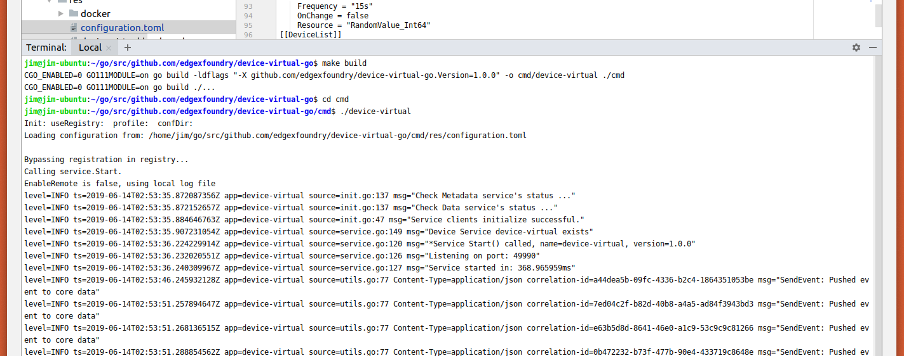
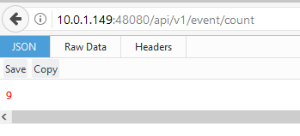

# Working in a Hybrid Environment

In some cases, as a developer, you want to work on a particular micro
service, but you don't want to have to download all the source code for
all the micro services and run all the micro services in the development
tool(s) like Go Land. In this case, you can download and run the EdgeX
Docker containers for all the micro services you need and run your
single micro service (the one you are presumably working on) from the
developer tool of choice and have it point to the other micro services
by appropriate address. Within EdgeX, we call this a "hybrid"
environment - where part of your EdgeX platform is running from a
development environment, while other parts are running from the
Dockerized containers. This page outlines how to do hybrid development.

As an example of this process, let's say you want to do coding work
with/on the Virtual Device service in Go Land. You want the rest of the
EdgeX environment up and running via Docker containers. How would you
set up this hybrid environment? Let's take a look.

## Get and Run the EdgeX Docker Containers

1.  Per [Getting Started Users](./Ch-GettingStartedUsers.md), get
    Docker, Docker Compose setup and then pull the EdgeX docker
    containers.
2.  Since you are working with the virtual device, you probably don't
    need or want to run all the micro services. You just need the few
    that the Virtual Device will be communicating with or that will be
    required to run a minimal EdgeX environment. So you will need to run
    Consul, Mongo, Core Data, Core Metadata, Core Command, Support
    Logging, and Support Notifications. After pulling the EdgeX
    containers, start these containers with a docker-compose up -d
    command or by starting each of the services individually with the
    following commands in order


| Docker Command    | Description          | Notes         |
|--------------|-----------------------------------|-------------------|
| `docker-compose up -d volume` |  Start the EdgeX Foundry file volume–must be done before the other services are started ||
| `docker-compose up -d consul` | Start the configuration and registry microservice which all services must register with and get their configuration from | |
| `docker-compose up -d config-seed` | Populate the configuration/registry microservice	| |
| `docker-compose up -d mongo` | Start the NoSQL MongoDB container	| An embedded initialization script configures the database for EdgeX documents|
|`docker-compose up -d logging`| 	Start the logging microservice - used by all micro services that make log entries	 |
|`docker-compose up -d notifications`| 	Start the notifications and alerts microservice–used by many of the microservices	 |
|`docker-compose up -d metadata`| 	Start the Core Metadata microservice	 |
|`docker-compose up -d data`| 	Start the Core Data microservice	 |
|`docker-compose up -d command`| 	Start the Core Command microservice	 |


Run a **"docker-compose ps"** command to confirm that all the
containers have been downloaded and started. (Note: initialization or
seed containers, like config-seed, will have exited as there job is just
to initialize the associated service and then exit.)

## Get and Run the Code In Go Land

1.  Per [Getting Started Go Developers](./Ch-GettingStartedGoDevelopers.md), get your development environment (GoLand et. al) setup
    and pull the micro service code you want to work on from GitHub. In
    this example, we assume you want to get the device-virtual-go
    project and import it into Go Land.
2.  Next, import the device-virtual-go project into Go Land. Follow the
    instructions in the Import the Project section of
    [Getting Started Go Developers](./Ch-GettingStartedGoDevelopers.md) if
    you need help getting the project into Go Land.
3.  Now configure the device-virtual-go project in Go Land to use the
    other micro services running in Docker.

-   Open the configuration.toml file in the cmd/res folder of the
    device-virtual-go project in Go Land. Note that the Registry
    (located in the \[Registry\] section of the configuration) and all
    the "clients" (located in the \[clients\] section of the
    configuration file) suggest that the "Host" of these services is
    "localhost".
-   When everything - including the device-virtual service - are running
    all together on the same host or in the same Docker environment, the
    host is assumed to be localhost. The services running in Docker are
    not running on "localhost". Instead, they are running in the
    Docker Engine. Therefore, the "Host" configuration setting needs
    to be modified in the configuration.toml for the Registry and other
    client services to be the IP address of the Docker Engine hosting
    the services. The Docker Engine IP address varies by environment.
    For Linux based systems, the IP address for the Docker Engine is
    typically 172.17.0.1. In Windows environments, the IP address of
    Docker Engine is typically 192.168.99.100. Docker networking
    configurations vary so check your system for the appropriate Docker
    network. Find information on Docker container network here: [Docker
    Network](https://docs.docker.com/v17.09/engine/userguide/networking/).
-   In the configuration.toml file in the cmd/res folder of the
    device-virtual-go project in Go Land, change the Host property for
    the Registry Clients.Data, Clients.Metadata, and Clients.Logging
    from "localhost" to the IP address for the Docker Engine of your
    system. Below, localhost is changed to the 172.17.0.1 IP address for
    the Docker Engine.

``` toml
[Registry]
Type = "consul"
Host = "172.17.0.1"
Port = 8500
CheckInterval = "10s"
FailLimit = 3
FailWaitTime = 10

[Logging]
EnableRemote = false
File = "./device-virtual.log"

[Writable]
LogLevel = 'INFO'

[Clients]
[Clients.Data]
Name = "edgex-core-data"
Protocol = "http"
Host = "172.17.0.1"
Port = 48080
Timeout = 5000

[Clients.Metadata]
Name = "edgex-core-metadata"
Protocol = "http"
Host = "172.17.0.1"
Port = 48081
Timeout = 5000

[Clients.Logging]
Name = "edgex-support-logging"
Protocol = "http"
Host = "172.17.0.1"
Port = 48061
```

Save the configuration.toml file after making these changes.

**Run device-virtual**

Now you can run device-virtual-go in Go Land that uses the rest of EdgeX
Dockerized services. For example, in the Go Land terminal, make sure you
are in the device-virtual-go directory and first build the service with
a call to make build. After successfully building the service, run the
service by going into the cmd folder and executing ./device-virtual (as
shown below).



**Check the Results**

At this time, your virtual device micro service running in Go Land
should be communicating with the other EdgeX micro services running in
their Docker containers. Give the virtual device a few seconds or so to
initialize itself and start sending data to Core Data. To check that it
is working properly, open a browser and point your browser to Core Data
to check that events are being deposited. You can do this by calling on
the Core Data API that checks the count of events in Core Data
(<http://[host].48080/api/v1/event/count>).


