# Getting Started - Users

## Introduction

These instructions are for Users to obtain and run EdgeX Foundry.
(Developers should read:
[Getting Started Developers](./Ch-GettingStartedDevelopers.md))

EdgeX Foundry is a collection of more than a dozen microservices that
are deployed to provide minimal edge platform capability. EdgeX Foundry
microservice source code can be downloaded and built into deployment
artifacts, but if you are not a Developer, or if you do not have a
specific need to run EdgeX Foundry "natively," you do not need to
download source code.

Users have the easier option to use Docker and run EdgeX Foundry in
microservice Docker containers. EdgeX Foundry microservices are
automatically built and containerized as new code is checked into the
source repository. Therefore, "Dockerized" EdgeX Foundry is not only
easier to obtain and deploy to your environment, but can also have the
most up-to-date EdgeX Foundry microservices (depending on which
container registry is used to get the microservices).

To obtain and run EdgeX Foundry, perform the following steps:

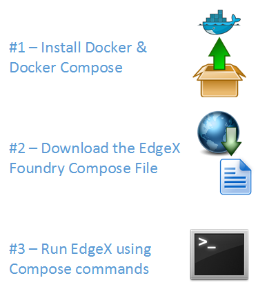

## Platform Requirements

EdgeX Foundry is an operating system (OS)-agnostic and hardware
(HW)-agnostic IoT edge platform. While minimum platform requirements are
yet being established, at this time the following options are
recommended:

-   Memory: minimum of 1 GB
-   Hard drive space: minimum of 3 GB of space to run the EdgeX Foundry
    containers, but you may want more depending on how long sensor and
    device data is to be retained
-   OS: EdgeX Foundry has been run successfully on many systems, including, but not limited to the following systems
    -   Windows (ver 7 - 10)
    -   Ubuntu Desktop (ver 14-16)
    -   Ubuntu Server (ver 14)
    -   Ubuntu Core (ver 16)
    -   Mac OS X 10

## Get & Run EdgeX Foundry

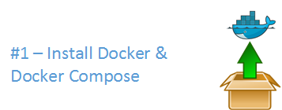

### Install Docker & Docker Compose

To run Dockerized EdgeX Foundry, you need to install Docker. See
<https://docs.docker.com/install/> to learn how to obtain and install
Docker. If you are new to using Docker, the same web site provides you
additional information. The following short video has is also very
informative
<https://www.youtube.com/watch?time_continue=3&v=VhabrYF1nms>

Docker Compose is used to orchestrate the fetch (or pull), installation,
and the start and stop of the EdgeX Foundry microservice containers.
See: <https://docs.docker.com/compose/> to learn more about Docker
Compose.

Docker Compose is automatically installed with Docker for Mac and
Windows users. See: <https://docs.docker.com/compose/install/> to
determine if your Docker installation already contains Docker Compose,
and how to install Compose if it does not.

You do not need to be an expert with Docker to obtain and run EdgeX
Foundry. The instructions in this guide provide you with the steps to
get EdgeX Foundry running in your environment. Some basic knowledge of
these two technologies of Docker and Docker Compose, are nice to have,
but not required. Basic Docker and Docker Compose commands, enable you
to run, update, and diagnose issues within EdgeX Foundry.

### Download the EdgeX Foundry Compose File

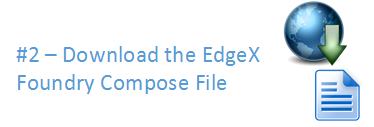

After installing Docker and Docker Compose, you need the Docker Compose
file that is a manifest of all the EdgeX Foundry microservices. EdgeX
Foundry has over 12 microservices, each deployed in their own Docker
container, in a typical EdgeX Foundry deployment.

If you know Docker and understand the architecture of EdgeX Foundry and
its microservices, you can manually issue Docker commands to download
and run each of the EdgeX Foundry containers yourself. Situations exist,
particularly in development situations, when you want to have this
manual control even though manually issuing commands can be a bit
tedious. More instructions are provided in this documentation set if you
need to have more control of downloading and running EdgeX Foundry
microservices.

Getting and running EdgeX Foundry microservices can also be accomplished
more easily provided you have the Docker Compose file that specifies to
Docker/Docker Compose which containers you want, and how you want to run
those containers. The EdgeX Foundry development team provides you with
Docker Compose files for each release through the EdgeX Foundry GitHub
repository. To obtain and run EdgeX Foundry, visit the project GitHub
and download (or copy the contents) of the EdgeX Foundry Docker Compose
file suitable to the version you wish to use - to a local directory.

The collection of the EdgeX Foundry Docker compose files are found here:
<https://github.com/edgexfoundry/developer-scripts/tree/master/releases>

Note that most of the Docker Compose files carry a specific version
identifier (like california-0.6.0) in the file name. These Compose files
help obtain the specific version of EdgeX. The docker-compose.yml file
will pull the latest tagged EdgeX microservices from Docker Hub. The
docker-compose-nexus.yml will pull the latest microservice images from
the developer's Nexus registry which contains the latest built
artifacts. These are typically work-in-progress microservice artifacts
and should not be used by most end users. It is recommended that you use
the latest version of EdgeX Foundry. As of this writing, the latest
version is: Delhi (version 0.7.1)

A Docker Compose file is a manifest file, which lists:

-   The Docker containers (or more precisely the Docker container
    images) that should be downloaded,
-   The order in which the containers should be started
-   The parameters under which the containers should be run

### Run EdgeX Foundry


Now that you have the EdgeX Foundry Docker Compose file, you are ready
to run EdgeX Foundry. Follow these steps to get the container images and
start EdgeX Foundry!

First, unless you downloaded docker-compose.yml, rename the Docker
Compose file you downloaded to `docker-compose.yml`. By default,
Docker Compose looks for a file by this name when running all Docker
Compose commands. You could use the original file name, but it would
require adding more arguments to the Docker Compose commands and creates
more circumstances for errors.

Next, open a command terminal to the Docker Compose file location - that
is where you download the EdgeX Foundry docker-compose.yml file above.
On some operating systems, there is a special Docker Terminal. On other
platforms, Docker and Docker Compose can be run from a normal terminal
window. See the Docker documentation for more help running Docker and
Docker Compose commands on your platform.

Now run the following command in the terminal to pull (but don't start)
all the EdgeX Docker images down to your system:

``` bash
docker-compose pull
```

After the Docker images are pulled, start EdgeX with this command in the
terminal:

``` bash
docker-compose up -d
```

The -d option indicates you want the Docker Compose to run the EdgeX
containers in detached mode - that is to run the containers in the
background. Without -d, the containers will all start in the terminal
and to use the terminal further you have to stop the containers.

In some situations, you may want to bring up the containers one at a
time using Docker Compose. If you are a developer or if you don't want
to bring up all of EdgeX (perhaps because you are just working with a
few of the services), you can issue Docker Compose commands to pull and
start each EdgeX container separately. Because some containers are
dependent on others, you should try to start them in a specific order.
The table below provides you the commands to start each of the EdgeX
microservices in the order they should be started (based on their
dependencies with one another). Essentially, the single Docker Compose
up command (docker-compose up -d) uses the manifest to run all of the
individual up command listed here in order.

|Docker Command	| Description|	Notes|
| --- | --- | --- |
|docker-compose pull |	Pull down, but don’t start, all the EdgeX Foundry microservices	| Docker Compose will indicate when all the containers have been pulled successfully |
|docker-compose up  -d volume	| Start the EdgeX Foundry file volume–must be done before the other services are started|
|docker-compose up  -d consul| Start the configuration and registry microservice which all services must register with and get their configuration from  |
|docker-compose up  -d config-seed |	Populate the configuration/registry microservice	 |
|docker-compose up  -d mongo|	Start the NoSQL MongoDB container	| An embedded initialization script configures the database for EdgeX documents|
|docker-compose up  -d logging|	Start the logging microservice - used by all micro services that make log entries	 |
|docker-compose up  -d notifications|	Start the notifications and alerts microservice–used by many of the microservices	 |
|docker-compose up  -d metadata|	Start the Core Metadata microservice	 |
|docker-compose up  -d data|	Start the Core Data microservice	 |
|docker-compose up  -d command|	Start the Core Command microservice	 |
|docker-compose up  -d scheduler|	Start the scheduling microservice -used by many of the microservices	 |
|docker-compose up  -d export-client |	Start the Export Client registration microservice	 |
|docker-compose up  -d export-distro |	Start the Export Distribution microservice	 |
|docker-compose up  -d rulesengine|	Start the Rules Engine microservice	| This service is still implemented in Java and takes more time to start|
|docker-compose up  -d| device-virtual	| Start the virtual device service|This service mocks a sensor sending data to EdgX and is used for demonstration|
 

Run a `docker-compose ps` command to confirm that all the
containers have been downloaded and started. (Note: initialization or
seed containers, like config-seed, will have exited as there job is just
to initialize the associated service and then exit.)


## Stop and Remove EdgeX Foundry

To stop and deconstruct (remove) all the EdgeX Foundry containers, call
on `docker-compose down`. Docker shows the containers being
stopped and then removed. Note, you may wish to stop (versus stop and
remove) all the EdgeX Containers. See more details in the Advanced EdgeX
Foundry User Command below.

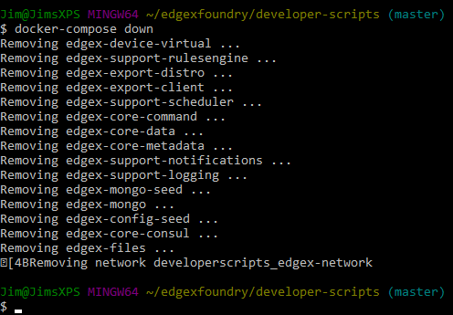

After this operation, calling docker-compose ps shows no running or
available containers.


## Advanced EdgeX Foundry User Commands

After you have mastered obtaining and running EdgeX Foundry, you may
want to take more control of EdgeX Foundry microservices. These commands
provide you the ability to do that. Pull Images

Use `docker-compose pull` to download all the container images
listed in the Compose file. The `docker-compose pull
[compose-container-name]` to download a specific container image
name from the Compose file. Here, the Export Client image is being
pulled.

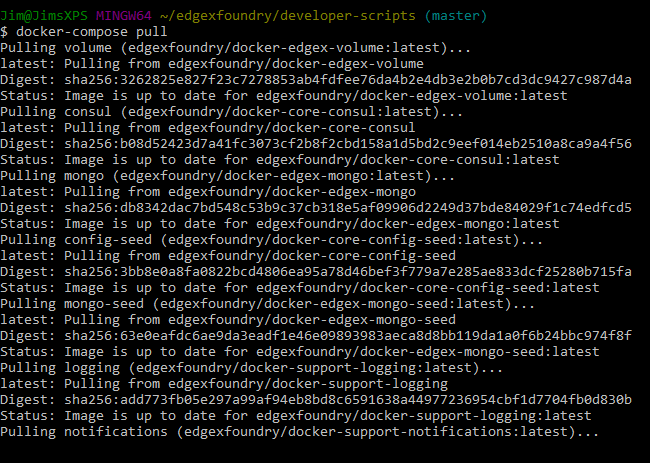

To get a list of the Docker Compose names of the containers (as they are
in the docker-compose.yml file), run `docker-compose config --services` as shown below.

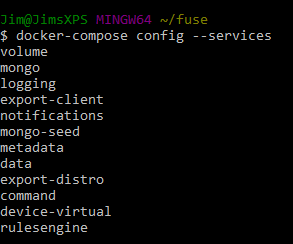

**Start Containers**

Use `docker-compose start` to re-start all the containers (after a
stop) \...

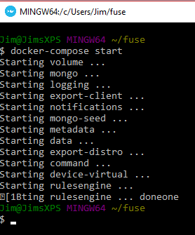

or `docker-compose start [compose-container-name]` to start an
individual container (after that container has been stopped). Here, the
volume container is started.

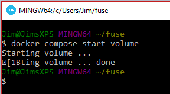

If you have stopped a specific container and updated its image (with
`docker-compose pull` above), this command allows you to
recreate/start the image without affect to other containers.

**Stop Containers**

To stop an individual container, you can use `docker-compose stop
[compose-container-name]`. Below the rulesengine container is
stopped. Stopped containers can be started again (using docker-compose
start above) versus docker-compose down with stops all the containers
and then destroys/removes all the containers.


To stop (but not remove) all containers, issue `docker-compose stop`.

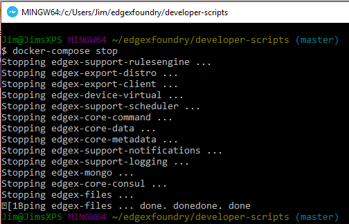

The docker-compose down command stops and then removes all the
containers, whereby docker-compose stop just stops the container(s) but
does not remove the container image. For example, if your run `docker
ps -a` after a `docker-compose stop`, you would still see the
container images in an "exited" state.


## Checking the Status of EdgeX Foundry

### Docker Container Status Check

As shown above, from the terminal, use `docker-compose ps` to get a
list of the containers that exist and are running. In additional, the
standard docker command (`docker ps -a`) can also provide the list of
running containers.

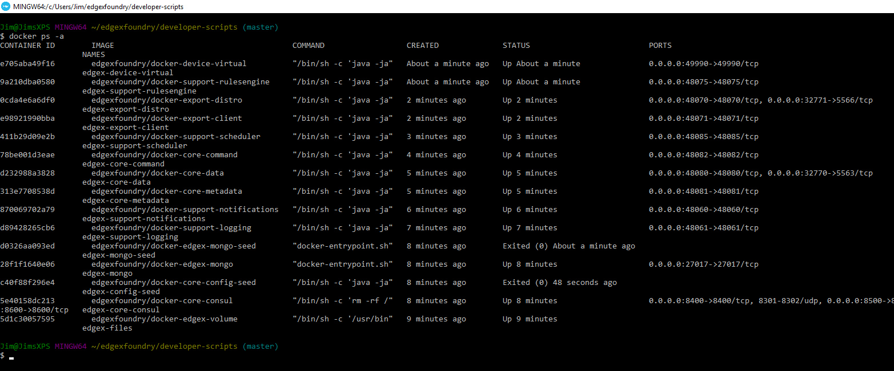

The standard docker command (`docker ps -a`) command also indicates
when the container was started, how long it has been running, and many
other details. You can use a `--format` option to retain only the
pertinent information in your list. See here for more details on
formatting the list of containers.


The status above was created using `docker ps -a --format "table {{.Names}}\t{{.Status}}\t{{.Ports}}\t{{.RunningFor}}"`

**EdgeX Foundry Container Logs**

To view the log of any container, use the command `docker-compose logs -f [compose-container-name]`. The example below shows the log
for the data container.


When you are done reviewing the content of the log, select **Control-c**
to stop the output to your terminal.

**Microservice Ping Check**

Each EdgeX Foundry microservice has been built to respond to a "ping"
HTTP request. A ping request or ping utility is used in networking
environments to check the reach-ability of a network resource (see
here). EdgeX Foundry uses the same concept to check the availability or
reach-ability of a microservice resource. After the EdgeX Foundry
microservice containers are running, you can "ping" any one of the
microservices to check that it is running. Open a browser or HTTP REST
client tool and use the service's ping address
(<http://host>:[port]/api/v1/ping) to see if it is available.
Below, the Core Data microservice is "pinged."

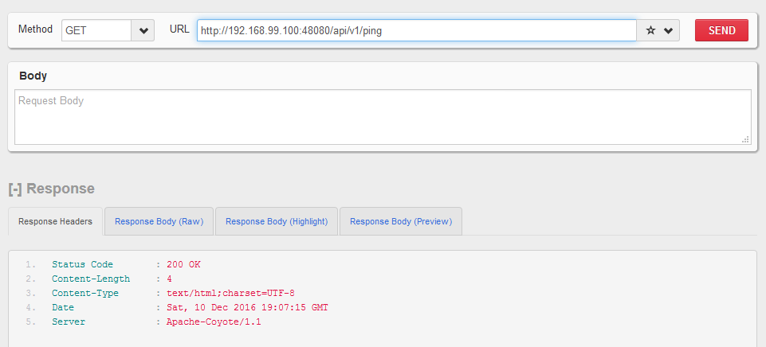

Below is a list of the EdgeX Foundry microservices, their ports, and
"ping" URLs.

|EdgeX Foundry Microservice	|Docker Compose Container|	Container Name|	Port|	Ping URL|
| --- | --- | --- | --- | --- |
|Core Command|	command	|edgex-core-command	|48082|	http://[host]:48082/api/v1/ping|
|Core Data|	data|	edgex-core-data	|48080|	http://[host]:48080/api/v1/ping|
|Core Metadata|	metadata|	edgex-core-metadata	|48081|	http://[host]:48081/api/v1/ping|
|Export Client|	export-client|	edgex-export-client	|48071|	http://[host]:48071/api/v1/ping|
|Export Distribution|	export-distro|	edgex-export-distro	|48070|	http://[host]:48070/api/v1/ping|
|Rules Engine|	rulesengine	|edgex-support-rulesengine	|48075|	http://[host]:48075/api/v1/ping|
|Support Logging|	logging	|edgex-support-logging	|48061|	http://[host]:48061/api/v1/ping|
|Support Notifications|	notifications	|edgex-support-notifications	|48060|	http://[host]:48060/api/v1/ping|
|Support Scheduler|	scheduler|	edgex-support-scheduler	|48085|	http://[host]:48085/api/v1/ping|
|Virtual Device Service|	device-virtual	|edgex-device-virtual	|49990|	http://[host]:49990/api/v1/ping|

The "host" address for the URLs above is determined by the Docker
Engine. The default Docker Engine IP address varies by operating system
(this can be configured on your system-see the Docker documentation for
details).

### EdgeX Foundry Consul Registry

EdgeX Foundry uses the open source Consul project as its registry
service. All EdgeX Foundry microservices are expected to register with
the Consul registry as they come up. Going to Consul's dashboard UI
enables you to see which services are up. Find the Consul UI at
<http://[host]:8500/ui>.

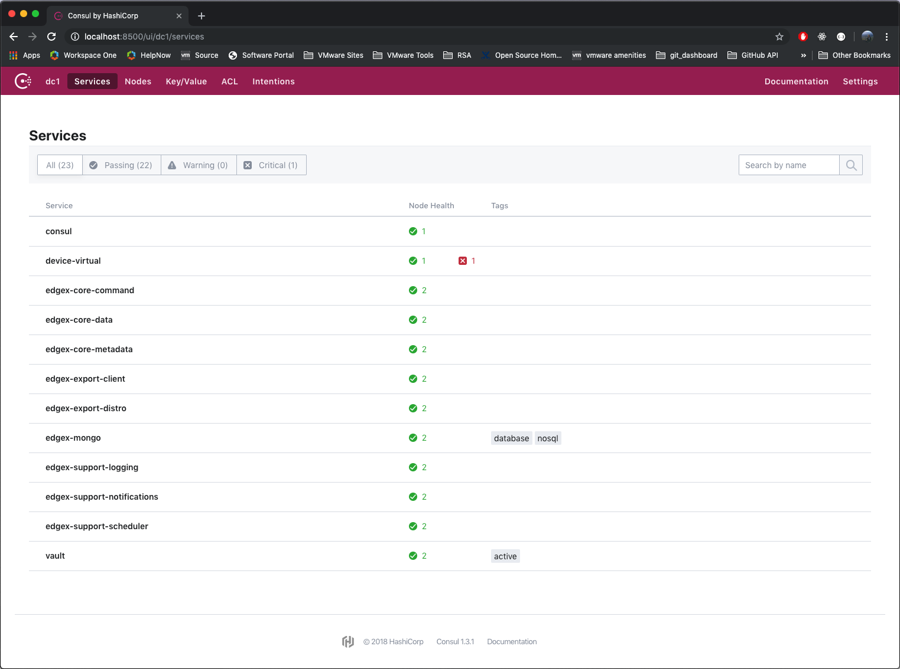
