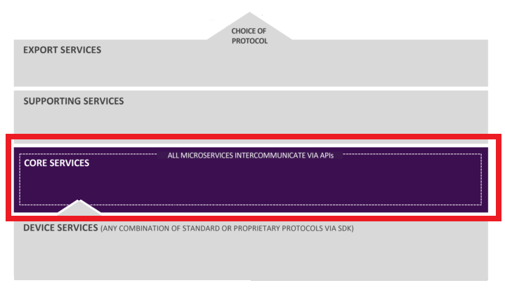
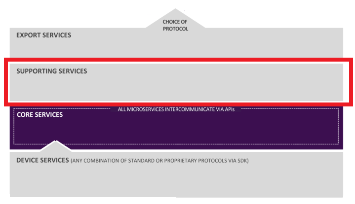
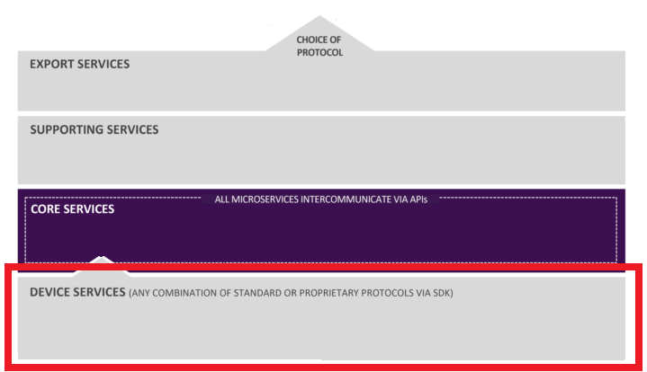
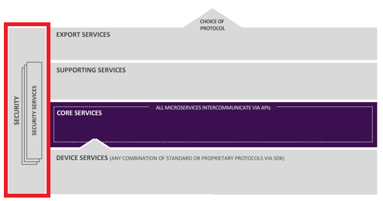
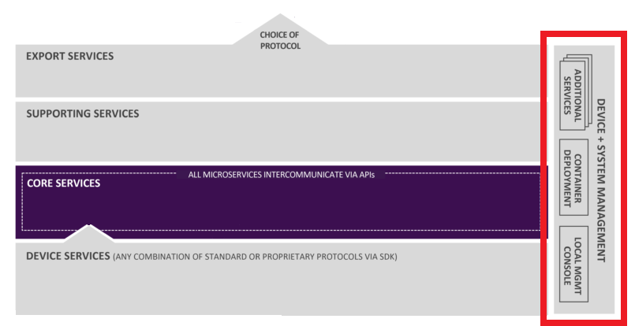

# Introduction

EdgeX Foundry is a vendor-neutral open source software platform at the
edge of the network, that interacts with the physical, every day working
world of devices, sensors, actuators, and other IoT objects. The intent
is to build a common framework for Industrial IoT edge computing. The
EdgeX platform enables and encourages the rapidly growing community of
IoT solution providers to work together in an ecosystem of interoperable
components to reduce uncertainty, accelerate time to market, and
facilitate scale.

By bringing this much-needed interoperability, EdgeX makes it easier to
monitor physical world items, send instructions to them, collect data
from them, move the data across the fog up to the cloud where it may be
stored, aggregated, analyzed, and turned into information, actuated, and
acted upon. So EdgeX enables data to travel northwards towards the Cloud
and also laterally to other gateways, or back to devices, sensors, and
actuators.

The initiative is aligned around a common goal: the simplification and
standardization of the foundation for tiered edge computing
architectures in the industrial IoT market while still enabling the
ecosystem to provide significant value-added differentiation.

If you don't need further description and want to immediately use EdgeX
Foundry use this link: Getting Started Guide

## Definitions: "South Side" and "North Side"

South Side: All IoT objects, within the physical realm, and the edge of
the network that communicates directly with those devices, sensors,
actuators, and other IoT objects, and collects the data from them, is
known collectively as the "South Side."

North Side: The Cloud (or Enterprise system) where data is collected,
stored, aggregated, analyzed, and turned into information, and the part
of the network that communicates with the Cloud, is referred to as the
"north side" of the network.

EdgeX enables data to be sent "north," "south," or laterally as
needed and as directed.

## EdgeX Foundry Architectural Tenets

**EdgeX Foundry was conceived with the following tenets guiding the
overall architecture:**

**EdgeX Foundry must be platform agnostic with regard to**

> Hardware Operating system (Linux, Windows, etc.) Distribution - it
> must allow for the distribution of functionality through microservices
> at the edge, on a gateway, in the fog, on cloud, etc. Protocol and
> sensor agnostic

**EdgeX Foundry must be extremely flexible**

> Any part of the platform may be upgraded, replaced or augmented by
> other micro services or software components Allow services to scale up
> and down based on device capability and use case EdgeX Foundry should
> provide "reference implementation" services but encourages best of
> breed solutions

**EdgeX Foundry must provide for store and forward capability (to
support disconnected/remote edge systems)** **EdgeX Foundry must support
and facilitate "intelligence" moving closer to the edge in order to
address**

> Actuation latency concerns Bandwidth and storage concerns Operating
> remotely concerns

**EdgeX Foundry must support brown and green device/sensor field
deployments** **EdgeX Foundry must be secure and easily managed**

## EdgeX Foundry Service Layers

EdgeX Foundry is a collection of open source microservices. These
microservices are organized into 4 service layers, and 2 underlying
augmenting system services. The Service Layers traverse from the edge of
the physical realm from the Device Services Layer, to the edge of the
information realm of the Export Services Layer, with the Core Services
Layer at the center.

The 4 Service Layers of EdgeX Foundry are as follows:

-   Core Services Layer
-   Supporting Services Layer
-   Export Services Layer
-   Device Services Layer

The 2 underlying System Services of EdgeX Foundry are as follows:

-   Security
-   System Management

## Core Services Layer

The Core Services (CS) Layer separates the north side and south side
layers at the edge. Core services include the following components:

-   Core data: a persistence repository and associated management
    service for data collected from the south side objects.
-   Command: a service that facilitates and controls actuation requests
    from the north side to the south side.
-   Metadata: a repository and associated management service of metadata
    about the objects that are connected to EdgeX Foundry. Provides the
    capability to provision new devices and pair them with their owning
    device services.
-   Registry and Configuration: provides other EdgeX Foundry
    microservices with information about associated services within
    EdgeX Foundry and microservices configuration properties (i.e. - a
    repository of initialization values).

## Supporting Services Layer

The Supporting Services (SS) Layer encompass a wide range of
microservices that provide the edge analytics and intelligence, and
provide service to EdgeX Foundry itself. Normal software application
duties such as logging, scheduling, and data clean up (scrubbing) are
performed by microservices in the SS Layer.

The rules engines, and alerting and notification microservices are
within the SS Layer because they operate on top of the Core Services
Layer. The local analytics capability (implemented today as a simple
rules engine) is also located in this layer.

## Device Services Layer

The Device Services Layer interacts with Device Services.

Device Services (DS) are the edge connectors interacting with the
Devices or IoT objects (the "things") that include, but are not
limited to: alarm systems, heating and air conditioning systems in homes
and office buildings, lights, machines in any industry, irrigation
systems, drones, currently automated transit such as some rail systems,
currently automated factories, and appliances in your home. In the
future, this may include driverless cars and trucks, traffic signals,
fully automated fast food facilities, fully automated self-serve grocery
stores, devices taking medical readings from patients etc.

Device services may service one or a number of devices (sensor,
actuator, and so forth) at one time. A "device" that a DS manages,
could be something other than a simple single physical device and could
be another gateway (and all of that gateway's devices); a device
manager; or a device aggregator that acts as a device, or collection of
devices, to EdgeX Foundry.

The DS layer's microservices communicate with the devices, sensors,
actuators, and other IoT objects through protocols native to each IoT
object. The DS Layer converts the data produced and communicated by the
IoT object into a common EdgeX Foundry data structure, and sends that
converted data into the Core Services layer, and to other microservices
in other layers of EdgeX Foundry.

EdgeX Foundry provides device service software developer kits (SDK) for
generating the shell of a device service. There are SDKs in Go and C to
support the creation of device services in the most convenient language
for your use case. SDKs make the creation of new device services easier
and provides connector code to the Core Services Layer (as well as other
services).

Examples of what work a Device Service does

-   A BACnet DS converts the BACNet device-supplied temperature and
    humidity readings into a common EdgeX Foundry object data structure.
-   A DS receives and translates commands from other EdgeX Foundry
    services or enterprise systems, and communicates those requests to
    the devices for actuation in a programming language that the device
    understands.
-   A DS may receive a request to turn off a Modbus PLC-controlled
    motor. The DS would translate the generic EdgeX Foundry "shutoff"
    request into a Modbus serial command that the PLC-controlled motor
    understands for actuation.

## System Services Layer

**Security Infrastructure**

Security elements both inside and outside of EdgeX Foundry protect the
data and command of devices, sensors, and other IoT objects managed by
EdgeX Foundry.

**System Management**

System Management facilities provide the central point of contact for
external management systems to \* start/stop/restart EdgeX services \*
get metrics on the EdgeX services (such as memory usage) so that the
EdgeX services can be monitored

In future releases, the EdgeX system management capability will expand
to include being able to set service configuration, provide a
status/health check of all of the services, and providing other
performance and operational information to management platforms.
