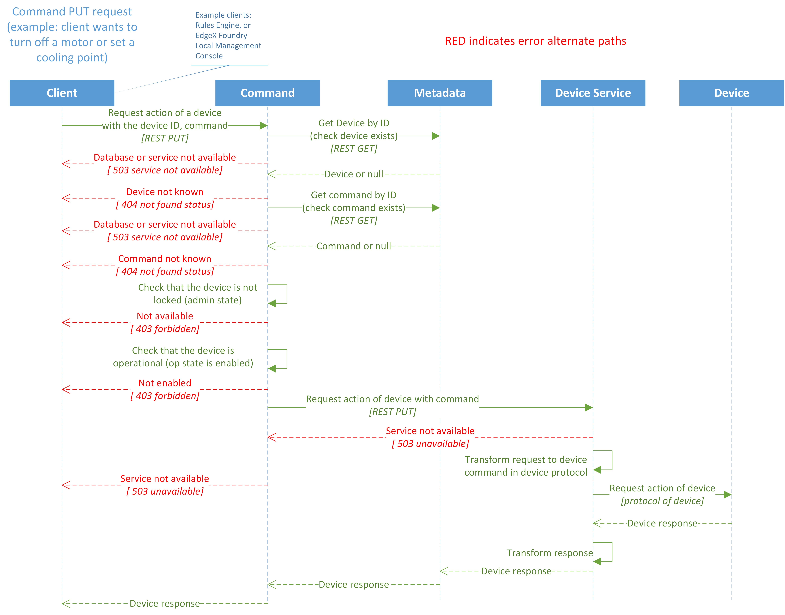
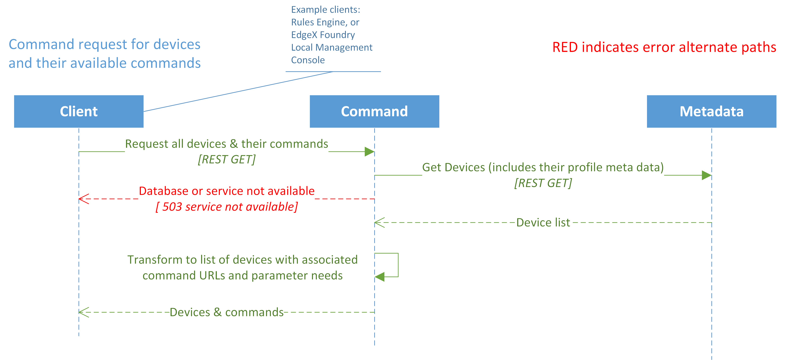

# Command

## Introduction

The Core Services Layer microservice Command (often called the Command
and Control microservice) enables the issuance of commands or actions to
devices and sensors on behalf of:

-   other microservices within EdgeX Foundry (for example, a local edge
    analytics or rules engine microservice)
-   other applications that may exist on the same system with EdgeX
    Foundry (for example, a system management agent that needs to
    shutoff a sensor)
-   To any external system that needs to command those devices (for
    example, a cloud-based application that had determined the need to
    modify the settings on a collection of devices)

The Command microservice exposes the commands in a common, normalized
way to simplify communications with the devices. Commands to devices are
made through the command GET, a request for data from the device or
sensor, and the command PUT, a request to take action or receive new
settings or data from EdgeX Foundry.

The Command microservice gets its knowledge about the devices and
sensors from the Metadata service. The Command service always relays
commands and actions to the devices and sensors through the Device
Service and never communicates directly to a device or sensor.
Therefore, the Command microservice is a translator of command or action
requests from the north side of EdgeX Foundry, such as the rules engine
and export facilities, to the protocol-specific device or sensor and
associated Device Service side of EdgeX Foundry and the gateway.

The Command service provides a layer of protection around devices and
sensors by not allowing unwarranted interaction with the devices and
sensors through the Device Service.

## Data Dictionary

  
  |Class Name|    Description|
  |----------------- |---------------------------------------------------------|
  |CommandResponse  | Contains the target and parameters and expected responses, that describe a REST call.|

## High Level Interaction Diagrams

The two following High Level Diagrams show:

-   EdgeX Foundry Command PUT Request
-   EdgeX Foundry Command Request for Devices and Their Available
    Commands

**EdgeX Foundry Command PUT Request**

**EdgeX Foundry Command Request for Devices and Their Available
Commands**

