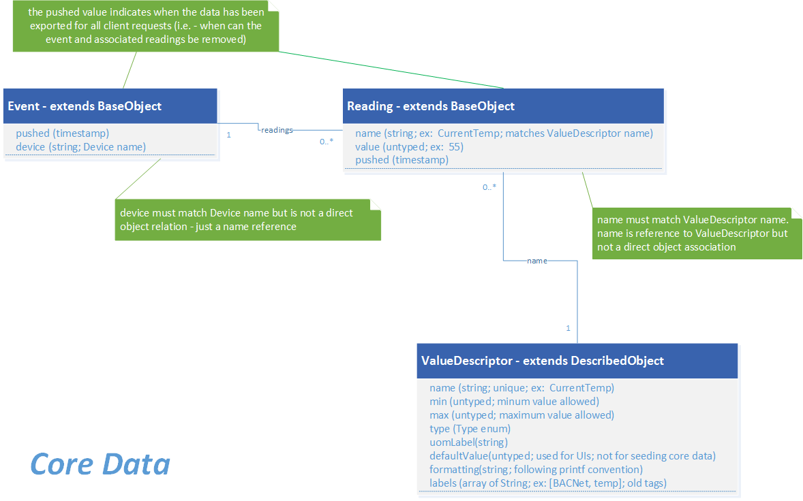
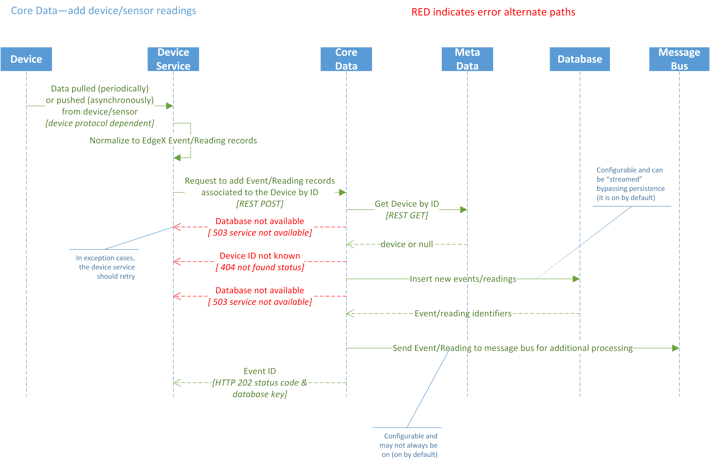
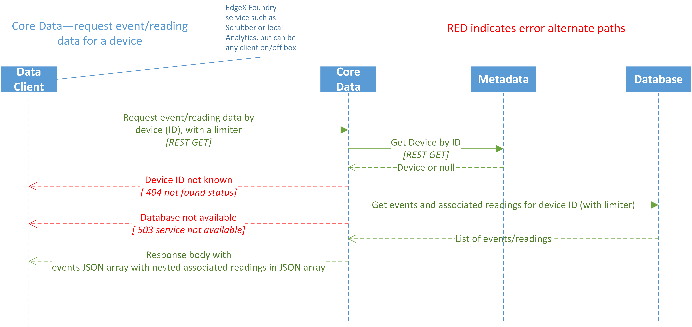

# Core Data

## Introduction

The Core Data microservice provides a centralized persistence facility
for data readings collected by devices and sensors. Device services for
devices and sensors that collect data, call on the Core Data service to
store the device and sensor data on the edge system (such as in a
gateway) until the data can be moved "north" and then exported to
Enterprise and cloud systems.

Other services, such as a Scheduling services, within EdgeX Foundry and
potentially outside of EdgeX Foundry, access the device and sensor data
stored on the gateway only through the Core Data service. Core Data
provides a degree of security and protection of the data collected by
devices and sensors while the data is at the edge.

Core Data uses a REST API for moving data into and out of the local
storage. In the future, the microservice could be expandable to allow
data to be accessed via other protocols such as MQTT, AMQP, and so
forth. Core Data moves data to the Export Service layer via ZeroMQ by
default. An alternate configuration of the Core Data microservice allows
the data to be distributed to the Export Services via MQTT, but would
also require the installation of a broker such as ActiveMQ.

The Rules Engine microservice receives its data from the Export
Distribution microservice by default. Where latency or volume are of
concern, an alternate configuration of the Rules Engine microservices
allows it to also get its data directly from Core Data via ZeroMQ (it
becomes a second subscriber to the same Export Services ZeroMQ
distribution channel).

## Core Data "Streaming"

By default, Core Data does persist all data collected by devices and
sensors sent to it. However, when the data is too sensitive to be stored
at the edge, or the need is not present for data at the edge to be used
by other services locally (e.g. by an analytics microservice), the data
can be "streamed" through Core Data without persisting it. A
configuration change to Core Data (persist.data=false) has Core Data
send data to the Export Service, through message queue, without
persisting the data locally. This option has the advantage of reducing
latency through this layer and storage needs at the network edge, but
the cost is having no historical data to use for operations based on
changes over time, and only minimal device actuation decisions, based on
single event data, at the edge.

## Data Model

The following diagram shows the Data Model for Core Data.

## Data Dictionary

| Class        | Description                                 |
| --- | --- |
| Event              | <ul><li>ID Device</li><li>Identifier</li><li>Collection of Readings</li> Event has a one-to-many relationship with Reading. |      
| Reading            | name-value pair Examples: "temp 62" "rpm 3000" The **value**is an Integer, Decimal, String, or Boolean.  The **name**  a value descriptor reference. The value descriptor defines information about the information the Reading should convey. |
| Value Descriptor   | This specifies a folder to put the log files.   |

## High Level Interaction Diagrams

The two following High Level Interaction Diagrams show:

> EdgeX Foundry Core Data add device or sensor readings EdgeX Foundry
> Core Data request event reading or data for a device

**Core Data Add Device or Sensor Readings**

**Core Data Request Event Reading or Data for a Device**

