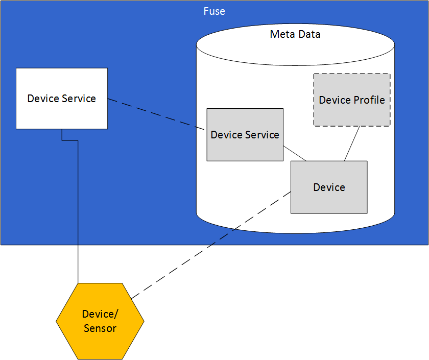
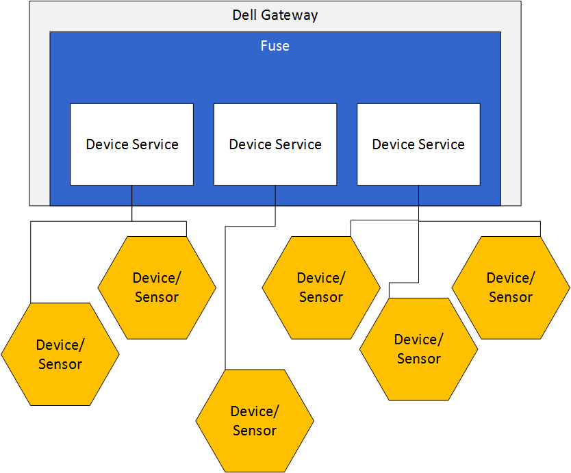
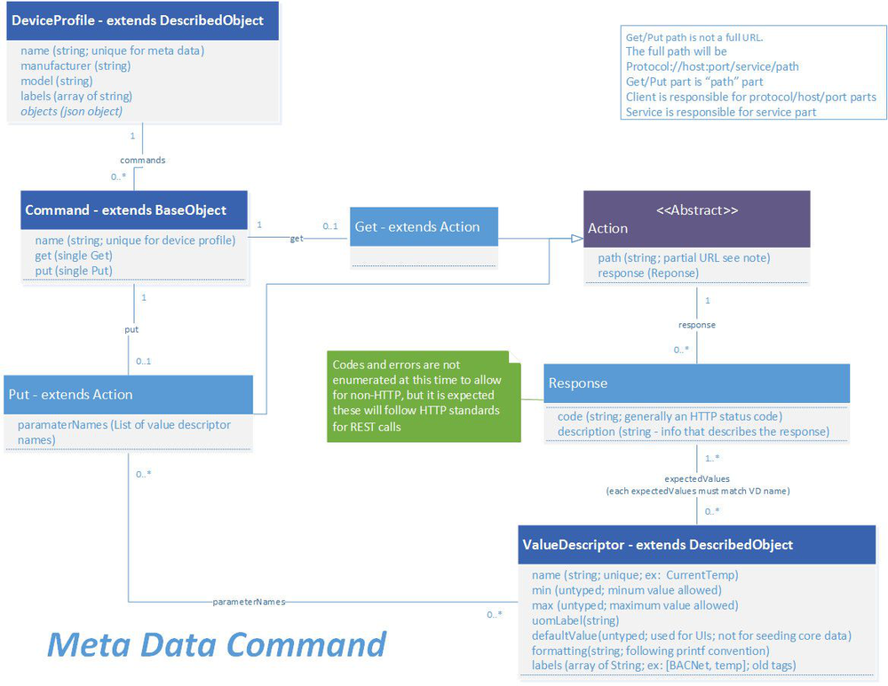
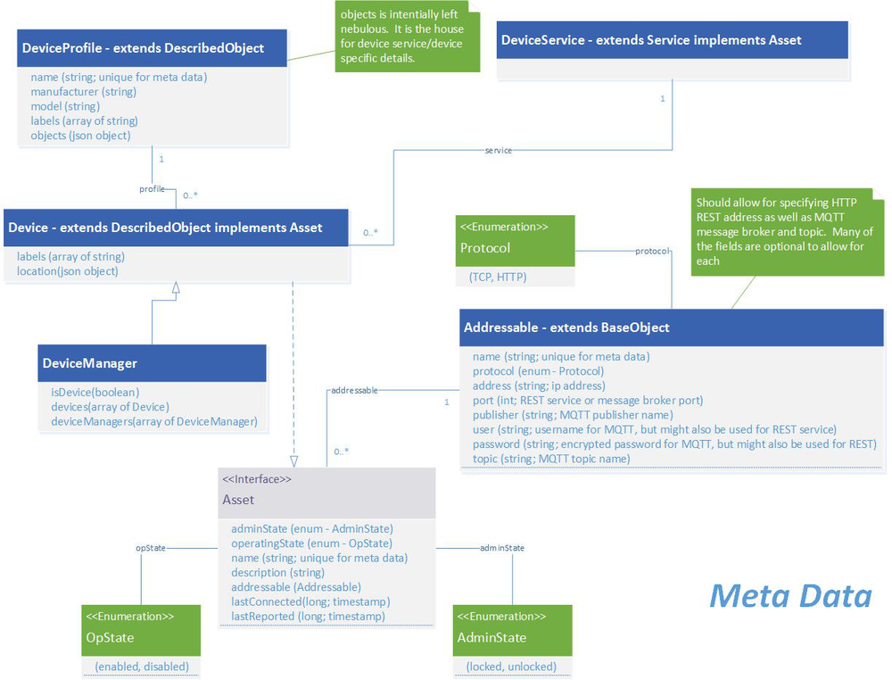
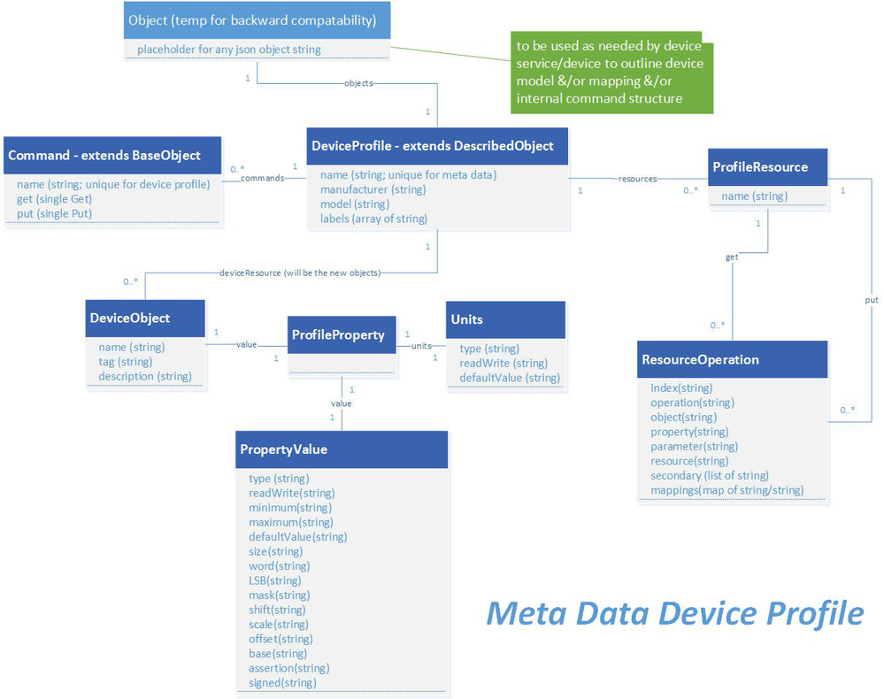
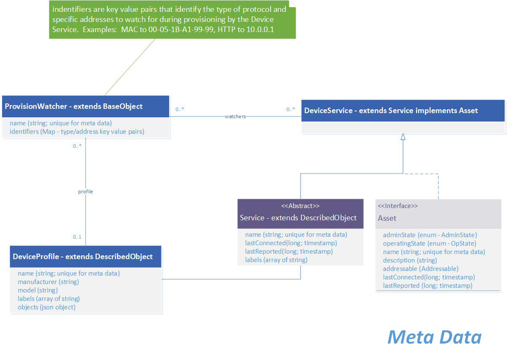
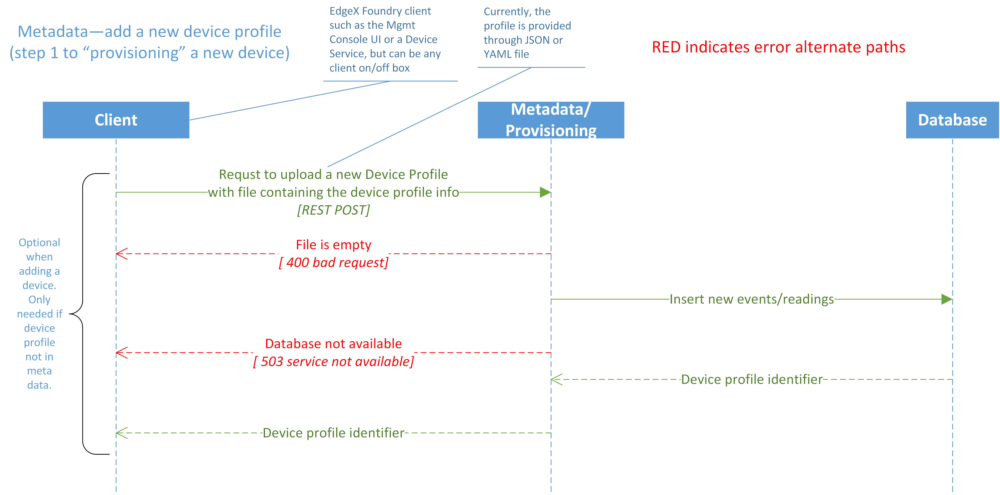
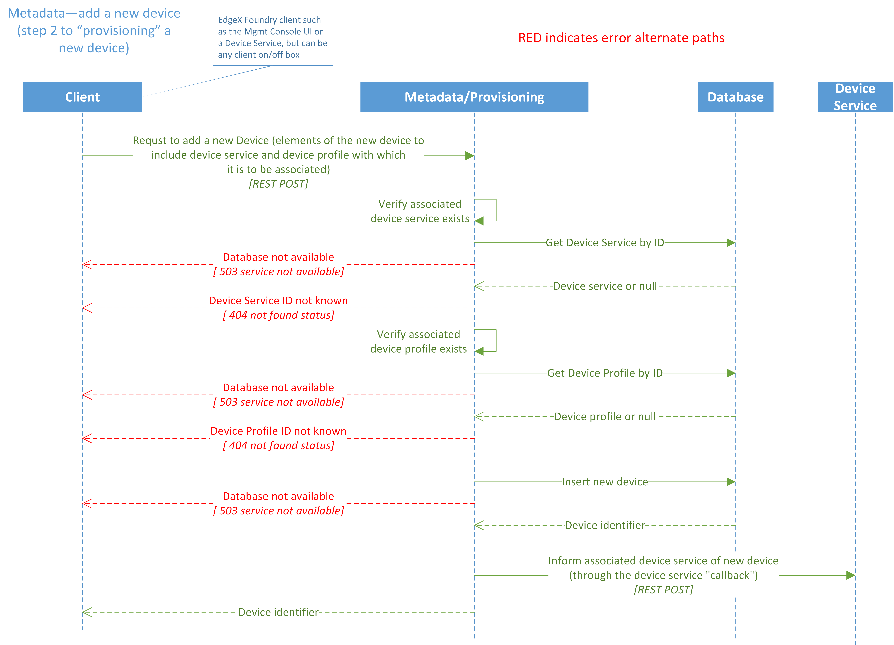
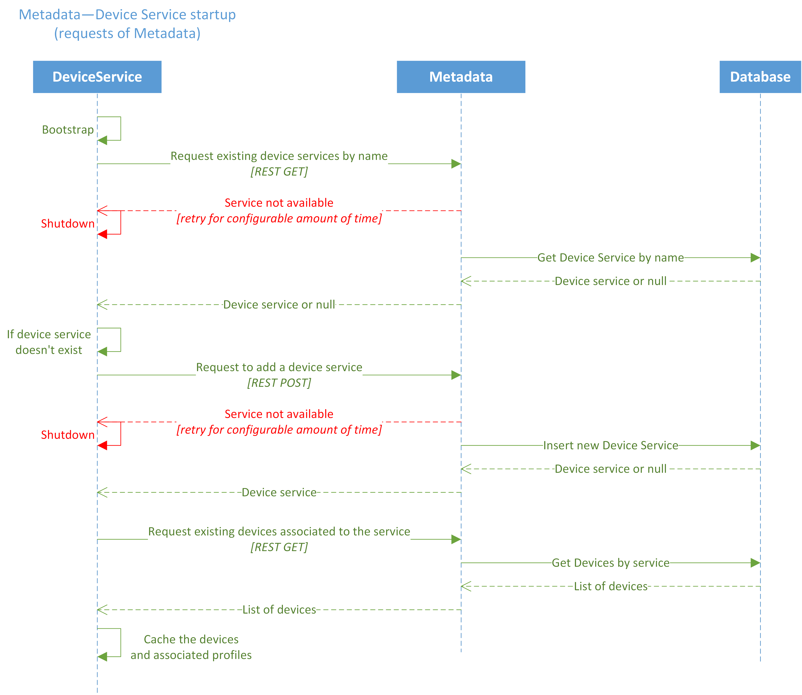

# Metadata

## Introduction

The Metadata microservice has the knowledge about the devices and
sensors and how to communicate with them that is used by the other
services, such as Core Data, Command, and so forth.

Specifically, Metadata has the following abilities:

-   Manages information about the devices and sensors connected to, and
    operated by, EdgeX Foundry
-   Knows the type, and organization of data reported by the devices and
    sensors
-   Knows how to command the devices and sensors

The Metadata does not do the following activities:

-   Does not do, and is not responsible for actual data collection from
    devices and sensors, which is performed by Device Services and Core
    Data
-   Does not do, and is not responsible for issuing commands to the
    devices and sensors, which is performed by Command and Device
    Service

General characteristics about Devices, the data they provide, and how to
command them is shown in Device Profiles in EdgeX Foundry. A Device
Profile can be thought of as a template of a type or classification of
Device. For example, a device profile for BACnet thermostats provides
general characteristics for the types of data a BACnet thermostat sends,
such as current temperature, and which types of commands or actions can
be sent to the BACnet thermostat, such as cooling set point, or heating
set point. Therefore, Device Profiles are the first item that the
Metadata service must be able to store or manage in local persistence,
and provide to the other services of EdgeX Foundry.

Data about actual devices and sensors is another type of information
that the Metadata microservice stores and manages. Each specific device
and sensor that is managed by EdgeX Foundry must be registered with
Metadata and have a unique ID associated to it. Information, such as the
device's or sensor's address is stored with that identifier. Each
device and sensor is also associated to a device profile. This
association enables Metadata to apply generic knowledge provided by the
device profile to each device and sensor. For example, a specific device
such as the BACNet thermostat located in the CTO Solutions lab in
Dell's building, is associated to the BACnet thermostat device profile
described above and this connection would imply that this specific
BACnet thermostat provides current temperature data and responds to
commands to set the cooling and heating points.

{.align-center}

Metadata stores and manages information about the device services that
serve as EdgeX Foundry's interfaces to the actual devices and sensors.
Device services are other microservices that communicate directly with
the device or sensor in the device or sensor protocol of choice, and
normalize information and communications with the device or sensor for
the rest of EdgeX Foundry. A single Device Service facilitates the
communications between EdgeX Foundry and one or more actual devices or
sensors. Typically, a Device Service is built to communicate through a
particular protocol with devices and sensors that use that protocol. For
example, a Modbus Device Service that facilitates the communications
among all types of Modbus devices such as motor controllers, proximity
sensors, thermostats, power meters, and so forth.

{.align-center}

### Data Models

**Metadata Command Model**

**Metadata Device and Device Profile Model**

**Metadata Device Profile Model**

**Metadata Provision Watcher Model**

## Data Dictionary

|Class Name|	Description	|Dependencies|
| --- | --- | --- |
|Action|	Contains the target and parameters and expected responses, that describe a REST call.	 |
|Addressable|	The metadata required to make a request to an EdgeX Foundry target. For example, the Addressable could be HTTP and URL address |details to reach a device service by REST and might include attributes such as HTTP Protocol, URL host of edgex-modbus-device-service, port of 49090.	| 
|AdminState|	An object’s current administrative state of “Locked” or”Unlocked.”	 |
|CallbackAlert|	The object used by the system to alert regarding a change to a system object.	 |
|Command|	The REST description of an interface.	 |
|Device|	The object that contains information about the state, position, reachability, and methods of interfacing with a Device|	Top Level object|
|DeviceManager|	An object that groups other Devices and groups of Devices.	 |
|DeviceResource|	The atomic description of a particular protocol level interface for a class of Devices.	 |
|DeviceProfile|	The description of both the protocol level interface, device service interface, and mapping and interpretation logic that describe communication to a class of devices. |	Top Level object
|DeviceReport|	 	 |
|DeviceService|	The current state and reachability information for a registered Device Services	 |
|OperatingState|	An object’s current operating state of “Enabled” or “Disabled.”	 |
|ProfileProperty|	The transformation, constraint, and unit properties for a class of Device data.	 |
|ProfileResource|	The set of operations that is executed by a Service for a particular Command.	 |
|PropertyValue|	The transformation and constraint properties for a class of data.	 |
|ProvisionWatcher|	The metadata used by a Service for automatically provisioning matching Devices.	 |
|ResourceOperation|	An Operation or set of Operations executed by the Device Service on a Device.	 |
|Response|	A description of a possible REST response for a Command.	 |
|Schedule|	An object defining a timer or alarm.|Top Level object|
|ScheduleEvent|	The action taken by a Service when the schedule triggers.|Top Level object|
|Service|	The current state and reachability information registered for a Service.	 |
|Units|	The unit metadata about a class of Device data.	 |

## High Level Interaction Diagrams

Sequence diagrams for some of the more critical or complex events
regarding Metadata.

The three following High Level Interaction Diagrams show:

1.  EdgeX Foundry Metadata Add a New Device Profile (Step 1 to
    provisioning a new device)
2.  EdgeX Foundry Metadata Add a New Device Profile (Step 2 to
    provisioning a new device)
3.  EdgeX Foundry Metadata Device Service Startup

Metadata Add a New Device Profile (Step 1 to provisioning a new device)

