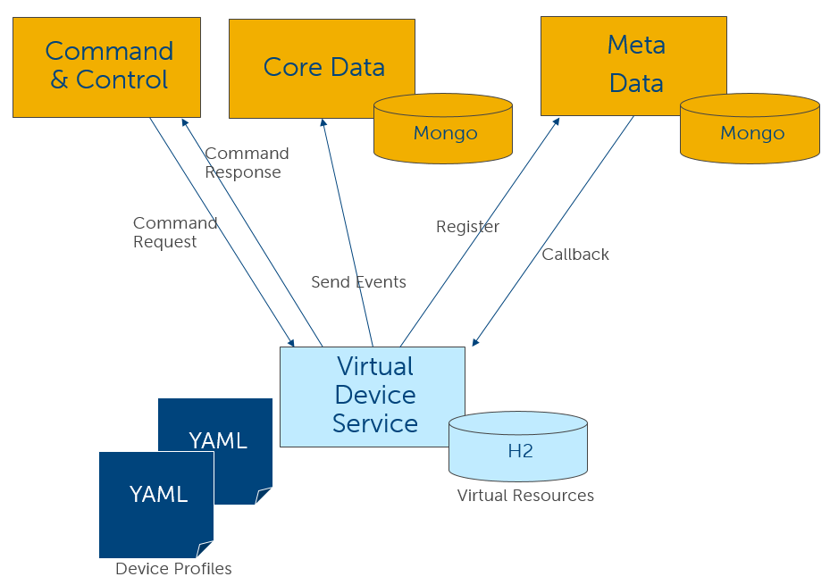
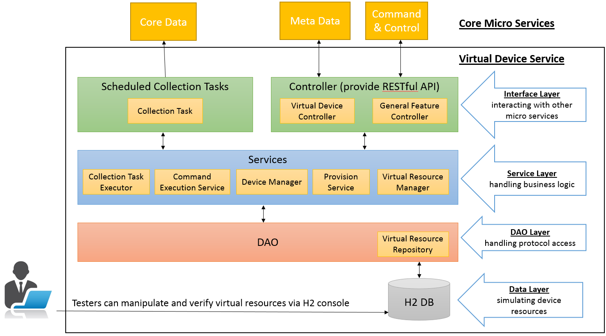
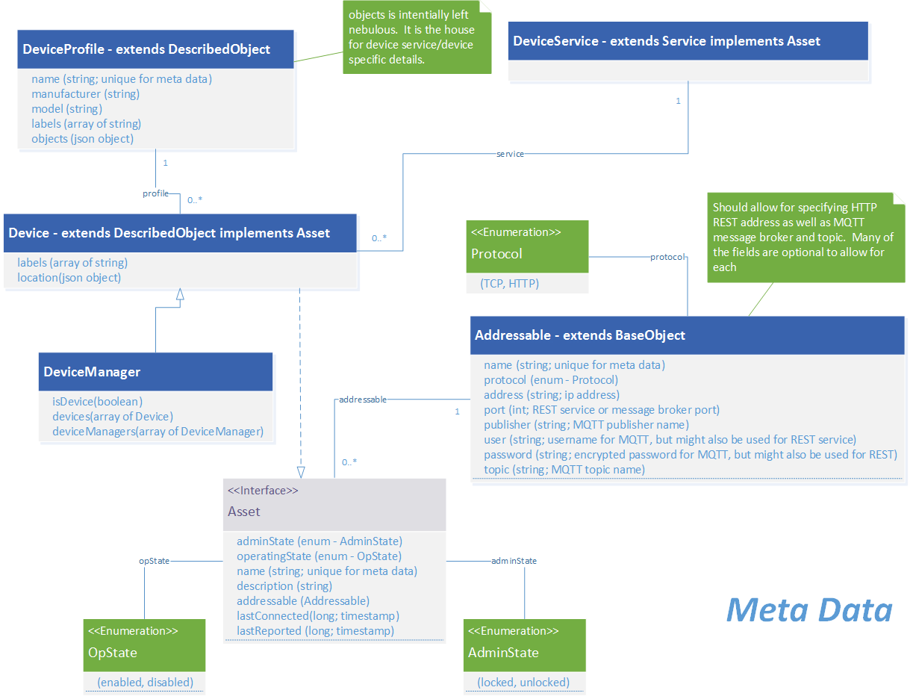
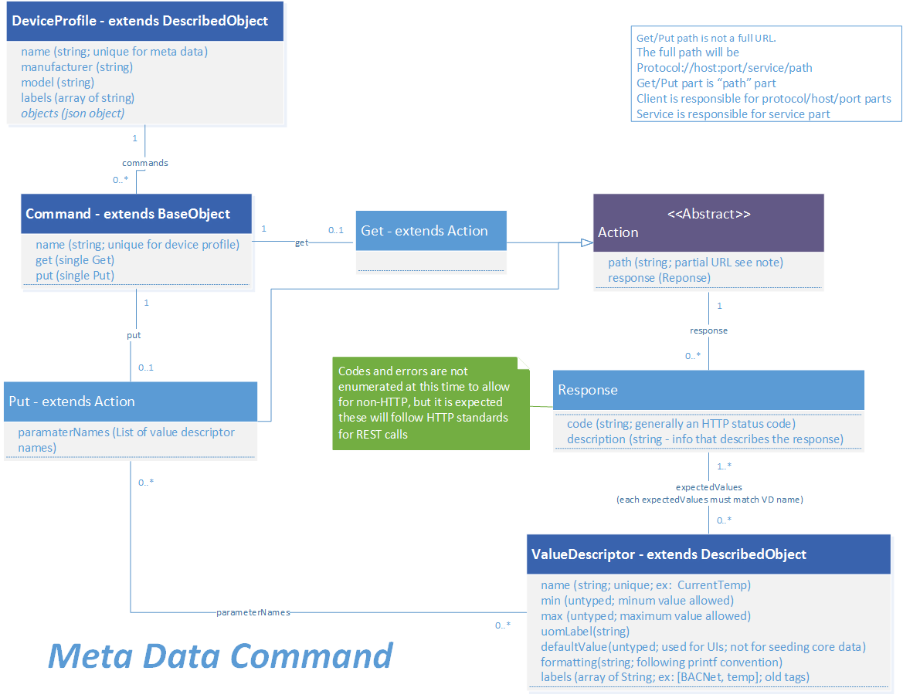
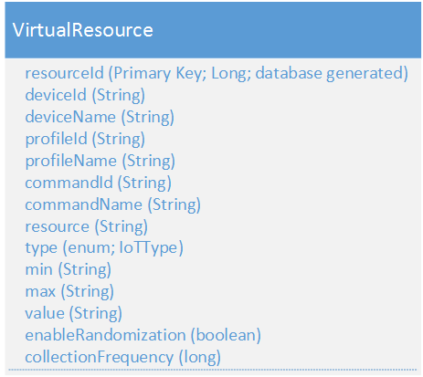

# Virtual Device

## Introduction

The Virtual Device Service simulates different kinds of devices to
generate Events and Readings to the Core Data Microservice, and Users
send commands and get responses through the Command and Control
Microservice. These features of the Virtual Device Services are useful
when executing functional or performance tests without having any real
devices.

**Virtual Device Service Overall Flow**

Virtual Device Service has dependencies on Core Data and Meta Data
Microservices, since the initialization process needs to check or
register profiles, devices, and value descriptors. Therefore, Core Data
and Metadata Microservices have to fully start up before Virtual Device
Service initialization. At the beginning of the Virtual Device Service
initialization process, the process sends a ping request to Core Data
and Metadata Microservices to verify their status until they both fully
start up. The fixed time out limit is 600 seconds. After 600 seconds, if
Core Data and Metadata Microservices have not fully started up, the
initialization process fails.

When the Virtual Device Service starts up, the initialization process
loads the definitions of ValueDescriptor, DeviceService, and
DeviceProfile from YAML files and creates them in the Metadata
Microservice. Some default YAML files exist, and Users can create their
own. Please see Device Profile Definition section (on this page) for
more detail. In addition, the Virtual Device Service provides callback
APIs for the Metadata Microservice to manage the Device instances.
According to the GET Commands in the DeviceProfile definitions, there is
an H2 database (in-memory) storing resource in Virtual Devices, called
"Virtual Resources."

## Virtual Resources Example

After starting up, the Virtual Device Service reads the H2 database and
periodically sends the current value as an Event to the Core Data
Microservice. The default frequency is 15 seconds, and that can be
modified from the configuration file. The current value of virtual
resources is re-generated at a random value before each collection
cycle, so the Reading should be different in each Event.

The Virtual Device Service provides APIs for Command and Control
Microservice, reads the H2 database, and returns the current value for
GET Commands. At this time, the Virtual Device Service supports two
special PUT Commands: "enableRandomization" and "collectionFrequency."
These Commands modify the "ENABLE\_RANDOMIZATION" and
"COLLECTION\_FREQUENCY" column of a specific virtual resource in the H2
database.

    For example, sending an HTTP PUT method to http://localhost:48082/device/56b1acf1d66f9c9762581ea4/command/56b1acedd66f9c9762581e9d/put/0 with the sample payload:

    {

      "enableRandomization": false,
      "collectionFrequency": 6

    }

modifies a virtual resource record whose command ID is
"56b1acedd66f9c9762581e9d " and device ID is
"56b1acf1d66f9c9762581ea4." By modifying the "ENABLE\_RANDOMIZATION"
column to FALSE, the value of the virtual resource will not re-generate
a random value anymore. By modifying the "COLLECTION\_FREQUENCY" column,
the collecting frequency will be changed after next collection cycle.

    They both can be modified manually through H2 Console: http://localhost:49990/console Modify the “JDBC URL” to jdbc:h2:mem:testdb, and click on “Connect.”

## Special Configuration

The virtual device micro service does contain some unique configuration
properties and these often change between development (for example when
run from Eclipse) and the containerized version (i.e. Docker container)
of the same service. Here are the list of unique properties you should
investigate before running the virtual device service to better
understand how it works in your environment:

The path used to locate the Device Profile YAML files used to define the
virtual devices managed by the device service (see Device Profile
Definition section below).

> **application.device-profile-paths=./bacnet\_sample\_profiles,./modbus\_sample\_profiles**

Indicator to the virtual device service to provisioning devices from the
YAML profiles in the above directory, creating one device for each
profile automatically when set to true.

application.auto-create-device=true When developing, it is often
advantageous to have the virtual device service start afresh and with a
clean Meta data database each time the service starts. The property
below indicates whether the device service should clean out any existing
virtual devices in the database when it shuts down so a clean
environment is available when the service starts backup. Typically set
to true for development and false for runtime/demonstration
environments.

> **application.auto-cleanup=true**

How often, in seconds, the virtual device service's scheduler should
collect data from the virtual device.

> **application.collection-frequency=15**

**Service Name and Host Name**

In EdgeX device services the service name (which is represented by
service.name key in the application.properties file or Consul
configuration) is the identity of the Device Service object. The name is
used by EdgeX to attribute all the information about the service (in
particular schedules, device ownership, etc.) to this name. However, the
service.host parameter is used to describe how to interact with the
service. Depending on your operating mode, the following guidelines for
configuring the service host apply.

**Deployment Mode (running everything containerized in Docker):** The
Service host (which is represented by the service.host key in the
application.properties file or Consul configuration) is the DNS or IP
address networking entry of the entity that the service is bound to
(container, machine, etc) and reachable from the other microservices.
This allows a full location URL for the service to be determined. In
Docker environments, the host name is the name of the Docker container
running the microservice (such as edgex-device-virtual).

Use service.host=\${service.name} and the docker-compose file for all
services (default).

**Important Note:** be sure to use Docker Compose and docker-compose
file (found in the developer-scripts repos) to bring up the containers
for all services. Docker Compose establishes the networking and
container naming for you, which can otherwise be difficult to do and
prone to errors if bringing up containers manually.

**Developer Mode** (running everything natively): When running a service
natively, the service names will not resolve to a DNS entry as they will
in a Docker environment.

Use service.host=localhost for all services (default).

**Hybrid Mode** (running some services natively with the rest deployed
with Docker): Use service.host=\<Host Machine IP Address\> for the
native services (manual configuration) and the docker-compose file to
bring up the containerized services (default). Ensure that Addressable
objects for the native services are not accidentally created by bringing
them up with the docker-compose file, otherwise conflicts may arise.
This issue is being addressed in future versions.

## System Architecture

The Virtual Device Service adopts a normal MVC design pattern,
separating logic into different layers.

**System Architecture Graphic**

**Interface Layer**\--interacting with other microservices. Controllers
provide the RESTful API. The implementation is located in
org.edgexfoundry.device.virtual.controller package. Scheduled Collection
Tasks is a set of async tasks which is executed periodically, and they
are created for each virtual resource (GET Command). See
org.edgexfoundry.device.virtual.scheduling package for the detailed
implementation. Also,
org.edgexfoundry.device.virtual.scheduling.Scheduler reads Schedule and
ScheduleEvent from Meta Data Microservice and arranges the collection
tasks.

Tasks execution logic is located in
org.edgexfoundry.device.virtual.service.impl.CollectionTaskExecutorImpl,
and the tasks creation behavior is located in
org.edgexfoundry.device.virtual.service.impl.VirtualResourceManagerImpl.createDefaultRecords().

**Service Layer**\--processing business logic, such as, executing
collection tasks and commands, managing profiles and devices, and so
forth. See org.edgexfoundry.device.virtual.service.impl package for more
details.

**DAO Layer**\--processing protocol access. For Virtual Device Services,
a Spring Data JPA interface in org.edgexfoundry.device.virtual.dao
package. Spring framework will process the communication effort to
access H2 DB.

**Data Layer**\--an H2 DB to simulate device resources.

## Device Profile Definition

Users can define any virtual device profile in YAML format, if the
structure is in accordance with the "Device and Device Profile Model"
(in the graphic 3 paragraphs below). By assigning the file path to
application property **"application.device-profile-paths"**, Virtual
Device Service loads all the YAML files under this folder, and this
property accepts multiple values separated by comma (,). For instance,
the following setting causes Virtual Device Service to load all YAML
files under **./bacnet\_sample\_profiles** and
**./modbus\_sample\_profiles** folders.

In addition to Profile Definition, ValueDescriptors are defined in the
"deviceResources.properties" part of the profile definition. The
structure needs to conform with the ProfileProperty in "Device
Profile" (in the graphic below the "Device and Device Profile
Model"), and the ValueDescriptors will be created and send to the Core
Data Microservice during the Device creation callback process.

By assigning the application property "application.auto-create-device"
= true (the default value is true), the Virtual Device Service creates
Device instances for each profile automatically during starting up, and
the Device instances start sending events and readings to Core Data
Microservice.

## Data Model

Virtual Device Service Data Model\--Device and Device Profile Model

**Virtual Device Service Data Model\--Command Model**

**VirtualResource**

VirtualResource is the data object generated from Device instances and
persisted in H2 database.

## Data Dictionary

  
  |Class Name|Description|
  |------------- |---------------------------------------------------------|
  |ScanList      |The object containing a protocol discovery method query.|
  |Transaction   |The asynchronous helper object used for gathering sets of device responses.|
  
