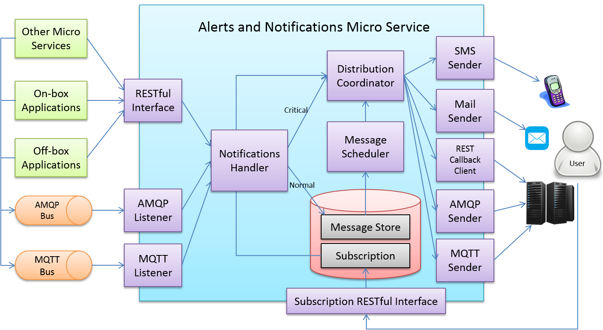
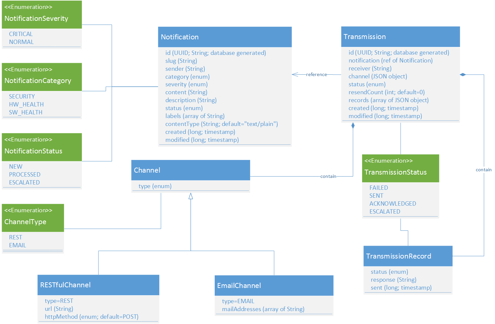
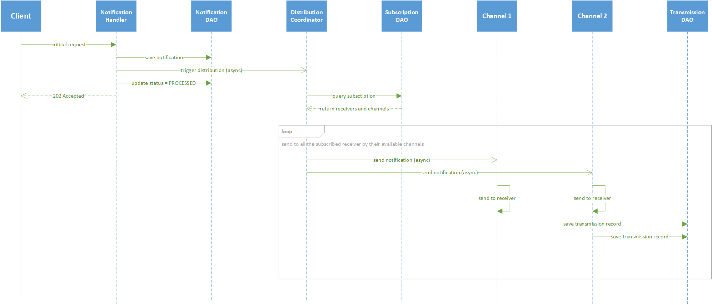
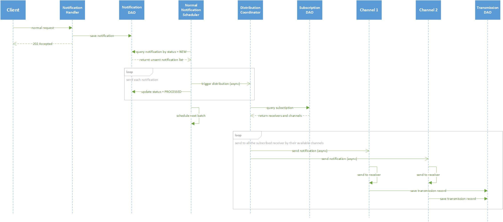
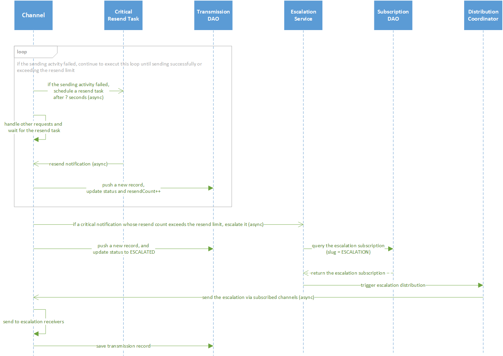
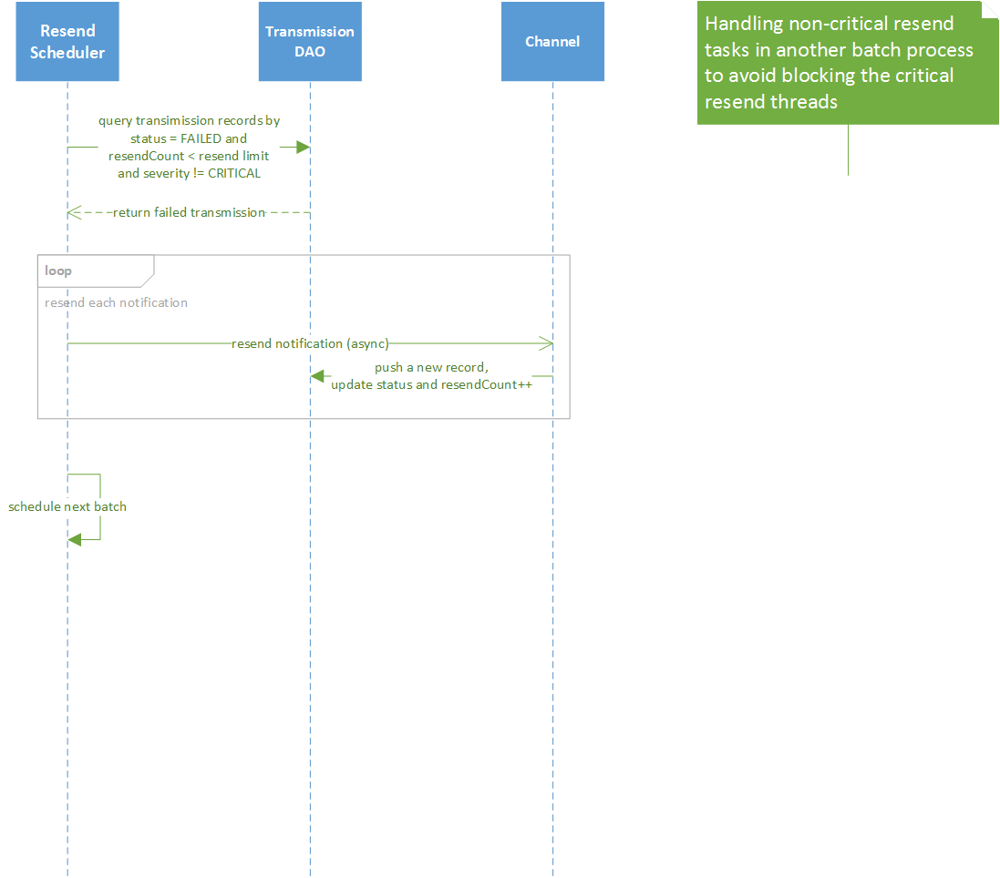
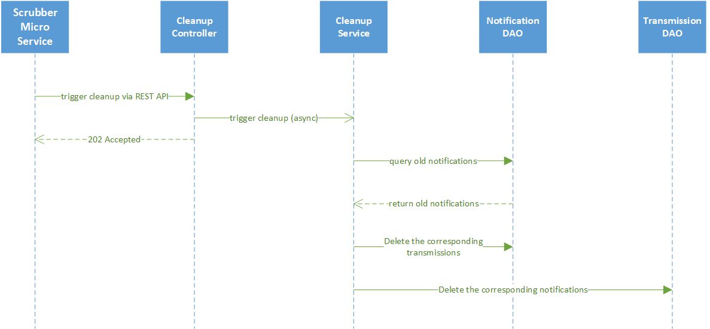

# Alerts & Notifications

## Introduction

When notification to another system or to a person, needs to occur to
notify of something discovered on the node by another microservice, the
Alerts and Notifications microservice delivers that information.
Examples of Alerts and Notifications that other services could need to
broadcast, include sensor data detected outside of certain parameters
(usually detected by a Rules Engine service) or system or service
malfunctions (usually detected by System Management services).
Terminology

**Notifications** are informative, whereas **Alerts** are typically of a
more important, critical, or urgent nature, possibly requiring immediate
action.

The diagram shows the high-level architecture of Alerts and
Notifications. On the left side, the APIs are provided for other
microservices, on-box applications, and off-box applications to use, and
the APIs could be in REST, AMQP, MQTT, or any standard application
protocols. Currently in EdgeX Foundry, the RESTful interface is
provided.

On the right side, the notification receiver could be a person or an
application system on Cloud or in a server room. By invoking the
Subscription RESTful interface to subscribe the specific types of
notifications, the receiver obtains the appropriate notifications
through defined receiving channels when events occur. The receiving
channels include SMS message, e-mail, REST callback, AMQP, MQTT, and so
on. Currently in EdgeX Foundry, e-mail and REST callback channels are
provided.

When Alerts and Notifications receive notifications from any interface,
the notifications are passed to the Notifications Handler internally.
The Notifications Handler persists the receiving notification first, and
passes them to the Distribution Coordinator immediately if the
notifications are critical (severity = "CRITICAL"). For normal
notifications (severity = "NORMAL"), they wait for the Message Scheduler
to process in batch.

The Alerts and Notifications is scalable, can be expanded to add more
severities and set up corresponding Message Schedulers to process them.
For example, the Message Scheduler of normal severity notifications is
triggered every two hours, and the minor severity notifications is
triggered every 24 hours, at midnight each night.

When the Distribution Coordinator receives a notification, it first
queries the subscription to acquire receivers who need to obtain this
notification and their receiving channel information. According to the
channel information, the Distribution Coordinator passes this
notification to the corresponding channel senders. Then, the channel
senders send out the notifications to the subscribed receivers.

## Data Model

MongoDB is selected for the persistence of Alerts and Notifications, so
the data model design is without foreign key and based on the paradigm
of document structure.

## Data Dictionary

  ------------------------------------------------------------------------
  **Class Name** **Description**
  -------------- ---------------------------------------------------------
  Channel        The object used to describe the Notification end point.

  Notification   The object used to describe the message and sender
                 content of a Notification.

  Transmission   The object used for grouping of Notifications.
  ------------------------------------------------------------------------

## High Level Interaction Diagrams

This section shows the sequence diagrams for some of the more critical
or complex events regarding Alerts and Notifications.

**Critical Notifications Sequence**

When receiving a critical notification (SEVERITY = "CRITICAL"), it
persists first and triggers the distribution process immediately. After
updating the notification status, Alerts and Notifications respond to
the client to indicate the notification has been accepted.

**Normal Notifications Sequence**

When receiving a normal notification (SEVERITY = "NORMAL"), it persists
first and responds to the client to indicate the notification has been
accepted immediately. After a configurable duration, a scheduler
triggers the distribution process in batch.

**Critical Resend Sequence**

When encountering any error during sending critical notification, an
individual resend task is scheduled, and each transmission record
persists. If the resend tasks keeps failing and the resend count exceeds
the configurable limit, the escalation process is triggered. The
escalated notification is sent to particular receivers of a special
subscription (slug = "ESCALATION").

**Resend Sequence**

For other non-critical notifications, the resend operation is triggered
by a scheduler.

**Cleanup Sequence**

Cleanup service removes old notification and transmission records.

## Configuration Properties

|Configuration|	Default Value	|Dependencies|
| --- | --- | --- |
|Service MaxResultCount |	50000 *	|Read data limit per invocation|
|Service BootTimeout |	300000 *	|Heart beat time in milliseconds|
|Service StartupMsg |	This is the Support Notifications Microservice *  Heart beat message|
|Service Port |	48060 **	|Micro service port number|
|Service Host |	localhost **	|Micro service host name|
|Service Protocol |	http **	|Micro service host protocol|
|Service ClientMonitor |	15000 **	 |
|Service CheckInterval |	10s **	 |
|Service Timeout |	5000 **	 |
|ResendLimit	|2 *	|Number of attempts to resend a notification|
|**Following config only take effect when logging.persistence=file**|
|Logging File	/logs/edgex-support-notifications.log| File path to save logging entries|
|Logging EnableRemote	false	Indicate whether to use the logging service (vs local log file)|
|**Following config only take effect when logging.persistence=database**|
|Databases Database Primary Username	|[empty string] **	|DB user name|
|Databases Database Password	|[empty string] *	|DB password|
|Databases Database Host	|localhost **	|DB host name|
|Databases Database Port	|27017 **	|DB port number|
|Databases Database Database	|logging *	|database or document store name|
|Databases Database Timeout	|5000 *	|DB connection timeout|
|Databases Database Type	|mongodb **	|DB type|
|**Following config only take effect when connecting to the registry for configuraiton info**|
|Registry Host	|localhost **	|Registry host name|
|Registry Port	|8500 **	|Registry port number|
|Registry Type	|consul **	|Registry implementation type|
|**Following config only take effect when connecting to the remote logging service**|
|Clients Clients.Logging Host	|localhost **	|Remote logging service host name|
|Clients Clients.Logging Port	|48061 **	|Remote logging service port number|
|Clients Clients.Logging Protocol	|http **	|Remote logging service host protocl|
|**Following config apply to using the SMTP service**|
|Smtp Host	|smtp.gmail.com **	|SMTP service host name|
|Smtp Port	|25 ** |	SMTP service port number|
|Smtp Password	|mypassword **	|SMTP service host access password|
|Smtp Sender	|jdoe@gmail.com **	|SMTP service sendor/username|
|Smtp Subject	|EdgeX Notification **	|SMTP alert message subject|

\*means the configuration value can be changed if necessary.

\*\*means the configuration value has to be replaced.

## Configure Mail Server

All the properties with prefix "smtp" are for mail server
configuration. Configure the mail server appropriately to send Alerts
and Notifications. The correct values depend on which mail server is
used.

### Gmail

Before using Gmail to send Alerts and Notifications, configure the
sign-in security settings through one of the following two methods:

1.  Enable 2-Step Verification and use an App Password (Recommended). An
    App password is a 16-digit passcode that gives an app or device
    permission to access your Google Account. For more detail about this
    topic, please refer to this Google official document:
    <https://support.google.com/accounts/answer/185833>.
2.  Allow less secure apps: If the 2-Step Verification is not enabled,
    you may need to allow less secure apps to access the Gmail account.
    Please see the instruction from this Google official document on
    this topic: <https://support.google.com/accounts/answer/6010255>.

Then, use the following settings for the mail server properties:

    Smtp Port=25
    Smtp Host=smtp.gmail.com
    Smtp Sender=${Gmail account}
    Smtp Password=${Gmail password or App password}

### Yahoo Mail

Similar to Gmail, configure the sign-in security settings for Yahoo
through one of the following two methods:

1.  Enable 2-Step Verification and use an App Password (Recommended).
    Please see this Yahoo official document for more detail:
    <https://help.yahoo.com/kb/SLN15241.html>.
2.  Allow apps that use less secure sign in. Please see this Yahoo
    official document for more detail on this topic:
    <https://help.yahoo.com/kb/SLN27791.html>.

Then, use the following settings for the mail server properties:

    Smtp Port=25
    Smtp Host=smtp.mail.yahoo.com
    Smtp Sender=${Yahoo account}
    Smtp Password=${Yahoo password or App password}
