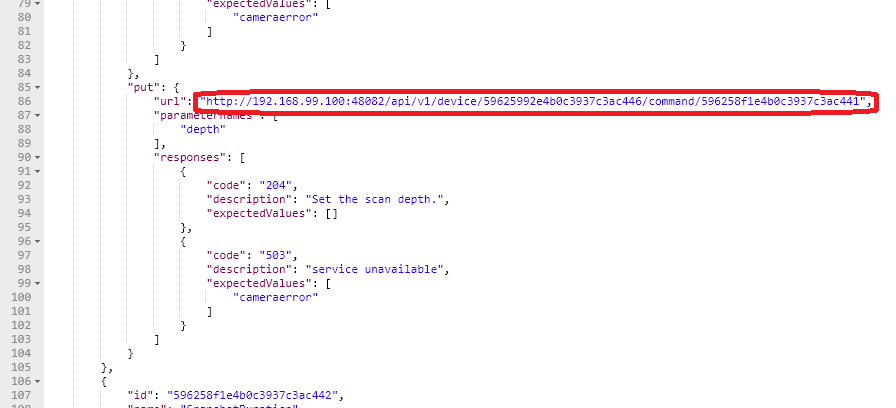

# Calling commands

Recall that the Device Profile (the camera monitor profile) included a
number of Commands to get and put information from any Device of that
type. Also recall that the Device (the countcamera1) was associated to
the Device Profile (the camera monitor profile) when the Device was
provisioned.

## List the Commands

See [APIs Core Services
Command](https://github.com/edgexfoundry/edgex-go/blob/master/core/command/raml/core-command.raml)

Now with all the setup complete, you can ask the Core Command micro
service for the list of Commands associated to the Device (the
countcamera1).

    GET to http://localhost:48082/api/v1/device/name/countcamera1

Note all of the URLs returned as part of this response! These are the
URLs that clients (internal or external to EdgeX) can call to trigger
the various get and put offerings on the Device.

### Check the Value Descriptors

See [APIs Core Services Core
Data](https://github.com/edgexfoundry/edgex-go/blob/master/api/raml/core-data.raml)

See that the Value Descriptors are in Core Data. There should be a total
of 5 Value Descriptors in Core Data. Note that Value Descriptors are
stored in Core Data, yet referenced in Metadata. This is because as data
coming from a Device is sent to Core Data, Core Data may need to
validate the incoming values against the associated Value Descriptor
parameters (like min, max, etc.) but without having to make a trip to
Core Metadata to do that validation. Getting data into Core Data is a
key function of EdgeX and must be accomplished as quickly as possible
(without having to make additional REST requests).

    GET to http://localhost:48080/api/v1/valuedescriptor

While we're at it, check that no data has yet been shipped to Core
Data. Since the Device Service and Device are in this demonstration
wholly manually driven by you, no sensor data should yet have been
collected. You can test this theory by asking for the count of Events in
Core Data.

    GET to http://localhost:48080/api/v1/event/count

## Execute a Command

While there is no real Device or Device Service in this walk through,
EdgeX doesn't know that. Therefore, with all the configuration and
setup you have performed, you can ask EdgeX to set the scan depth or set
the snapshot duration to the camera, and EdgeX will dutifully try to
perform the task. Of course, since no Device Service or Device exists,
as expected EdgeX will ultimately responds with an error. However,
through the log files, you can see a Command made of the Core Command
micro service, attempts to call on the appropriate Command of the
fictitious Device Service that manages our fictitious camera.

For example sake, let's launch a Command to set the scan depth of
countcamera1 (the name of the single human/dog counting camera Device in
EdgeX right now). The first task to launch a request to set the scan
depth is to get the URL for the Command to "PUT" or set a new scan
depth on the Device. As seen above request a list of the Commands by the
Device name with the following API on Core Command

    GET to http://localhost:48082/api/v1/device/name/countcamera1

Now locate and copy the URL for the PUT Depth Command. Because of the
IDs used, this will be different on each system so a generic API call
will not suffice here. Below is a picture containing a slice of the JSON
returned by the GET request above and desired PUT Command URL
highlighted - yours will vary based on IDs.

Copy this URL into your REST client tool of choice and make a PUT to
that URL on Core Command with the new depth as the parameter with that
request.

    PUT to http://localhost:48082/api/v1/device/<system specific device id>/command/<system specific command id>

    BODY:  {"depth":"9"}

Again, because no Device Service (or Device) actually exists, Core
Command will respond with an HTTP 502 Bad Gateway error. However,
checking the logging output will prove that the Core Command micro
service did receive the request and attempted to call on the
non-existent Device Service to issue the actuating command.

    docker logs edgex-core-command

    INFO: 2019/02/15 19:32:13 Issuing GET command to: http://172.17.0.1:49977/api/v1/devices/5c6711419f8fc200010f4ada/scandepth
    ERROR: 2019/02/15 19:32:13 Get http://172.17.0.1:49977/api/v1/devices/5c6711419f8fc200010f4ada/scandepth: dial tcp 172.17.0.1:49977: getsockopt: connection refused

