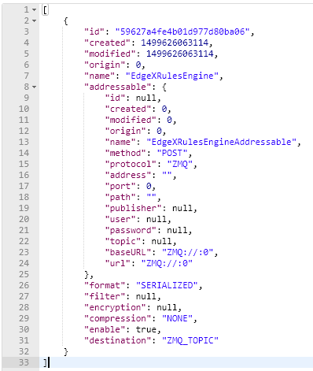

# Exporting your device data

Great, so the data sent by the camera Device makes it way to Core Data.
How can that data be sent to an enterprise system or the Cloud? How can
that data be used by an edge analytics system (like the Rules Engine
provided with EdgeX) to actuate on a Device? Anything wishing to receive
the sensor/device data as it comes into EdgeX must register as an
"export" client.

## Export Clients

In fact, by default, the Rules Engine is automatically registered as a
client of the export services and automatically receives all the
Events/Readings from Core Data that are sent by Devices. To see all the
existing export clients, you can request a list from the Export Client
micro service.

    GET to http://localhost:48071/api/v1/registration

The response from Export Client is a list of registered client details -
in this case just the Rules Engine is registered.

## Register an Export Client

To register a new client to receive EdgeX data, you will first need to
setup a client capable of receiving HTTP REST calls, or an MQTT topic
capable of receiving messages from EdgeX. For the purposes of this
demonstration, let's say there is an cloud based MQTT Topic that has
been setup ready to receive EdgeX Event/Reading data. To register this
MQTT endpoint to receive all Event/Reading data, in JSON format, but
encrypted, you will need to request Export Client to make a new EdgeX
client.

    POST to http://localhost:48071/api/v1/registration

    BODY: {"name":"MyMQTTTopic","addressable":{"name":"MyMQTTBroker","protocol":"TCP","address":"tcp://m10.cloudmqtt.com","port":15421,"publisher":"EdgeXExportPublisher","user":"hukfgtoh","password":"mypass","topic":"EdgeXDataTopic"},"format":"JSON","encryption":{"encryptionAlgorithm":"AES","encryptionKey":"123","initializingVector":"123"},"enable":true,"destination":"MQTT_TOPIC"}

Note that the Addressable for the REST address is built into the
request.

Now, should a new [Event be posted](./Ch-WalkthroughReading.md) to Core
Data, the Export Distro micro service will attempt to sent the
encrypted, JSON-formated Event/Reading data to the MQTT client. Unless
you have actually setup the MQTT Topic to receive the messages, Export
Distro will fail to deliver the contents and an error will result. You
can check the Export Distro log to see the attempt was made and that the
EdgeX Export services are working correctly, despite the non-existence
of the receiving MQTT Topic.

MQTTOutboundServiceActivator: message sent to MQTT broker:

    Addressable [name=MyMQTTBroker, protocol=TCP, address=tcp://m10.cloudmqtt.com, port=15421, path=null, publisher=EdgeXExportPublisher, user=hukfgtoh, password=mypass, topic=EdgeXDataTopic, toString()=BaseObject [id=null, created=0, modified=0, origin=0]] : 596283c7e4b0011866276e9

# Building your own solutions

Congratulations, you've made it all the way through the Walkthrough
tutorial!

